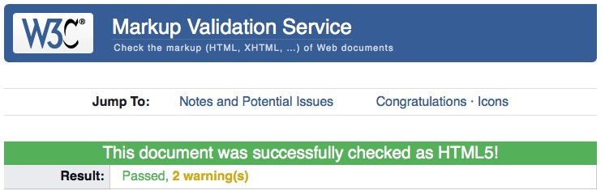
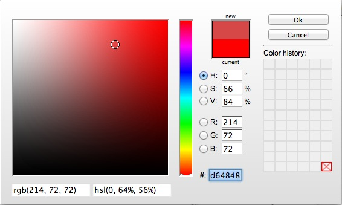

% TP1 : HTML
% Technologies du web
% Stéphane Bouvry, 2014

# Objectif

- Créer une page web simple
- Structurer les données textuelles
- Utiliser CSS pour mettre en forme le texte


# Première page web

Le contenu d’une page Web (la partie visible) est toujours placé dans le **corps du document**, soit entre les balises `<body>` et `</body>`.

#### Exercice

Utiliser l'éditeur de code *Brackets* <http://www.brackets.io/> pour saisir les lignes suivantes :

```html
<!DOCTYPE html>
<html>
<head>
	<title>Ma première page web</title>
</head>
<body>
	Bonjour HTML !
</body>
</html>
```

Enregistrez le fichier avec l'extension de fichier `.html` puis ouvrez le fichier dans le navigateur Firefox.

## Validation

Lors de la production de code HTML5, vous devrez vous assurer que le *code source* produit est valide. Cette étape est importante car elle vous prémunira des fautes de frappe ainsi que d'erreur dans la structure du code (mauvaise balise, erreur d'imbrication, etc...).

Vous valider votre code, allez sur le site officiel du W3C <http://validator.w3.org/>. Ensuite, uploadez votre fichier HTML ou copié/collé le code source.



<div class="information">
Il peut survenir 2 *Warnings* :

- L'un vous signifie que HTML5 est expérimentale,
- L'autre, si vous passer par la zone de texte, vous averti que vous devez passer par un upload pour valider l'encodage du fichier.
</div>

# Le texte dans HTML

## Encodage des caractères

Les navigateurs récents sont capables de détecter automatiquement l'**encodage du document**, mais il arrive que ça ne soit pas le cas. Il est donc d'usage d'indiquer dans le `head` l'encodage utilisé avec la balise *meta charset*.

#### Exercice

Modifier votre document pour y ajouter la *meta charset*.

```html
<!DOCTYPE html>
<html>
<head>
	<meta charset="utf-8">
	<title>Ma première page web</title>
</head>
<body>
	Bonjour HTML !
</body>
</html>
```

<div class="reference">
Découvrez d'où vient l'encodage : <http://french.joelonsoftware.com/Articles/Unicode.html>
</div>

## Caractères spéciaux

L'affichage de certains caractères en tant que texte posent des problèmes, à commencer par les chevrons `<>`. En effet, le navigateur, lorsque qu'il rencontre un chevron, va penser qu'il a affaire à une balise HTML. Pour afficher les caractères spéciaux, on a recourt aux **entités HTML**. Les entités HTML se présente toujours sous la forme `&entite;`{.xml};

Voici les plus répandues : 

<table class="table-bordered">
<thead>
<tr>
<th>Code</th>
<th>Numérique</th>
<th>Description</th>
</tr>
</thead>
<tbody>
<tr>
<td>`&nbsp;`{.xml}</td>
<td>`&#160;`{.xml}</td>
<td>
Espace insécable. Il permet d'éviter des retours à la ligne.

</td>
</tr>
<tr>
<td>`&laquo;`{.xml}</td>
<td>`&#171;`{.xml}</td>
<td>**«** guillemet ouvrant français</td>
</tr>
<tr>
<td>`&raquo;`{.xml}</td>
<td>`&#187;`{.xml}</td>
<td>**»** guillemet fermant français</td>
</tr>
<tr>
<td>`&hellip;`{.xml}</td>
<td>`&#830;`{.xml}</td>
<td>**…**  points de suspension.</td>
</tr>
<tr>
<td>`&amp;`{.xml}</td>
<td>`&#38;`{.xml}</td>
<td>**&**  "é" commercial ou Esperluette.</td>
</tr>
<tr>
<td>`&copy;`{.xml}</td>
<td>`&#169;`{.xml}</td>
<td>**©**  Copyright.</td>
</tr>
<tr>
<td>`&euro;`{.xml}</td>
<td>`&#128;`{.xml}</td>
<td>**€**  Symbole Euro.</td>
</tr>
</tbody>
</table>

A l'origine, tous les caractères non-ASCII devaient être dans le code source HTML sous la forme d'une entité HTML. Si vous être amené à produire des documents pour des (très) vieux systèmes, vous serez contraint de les utiliser.

<div class="reference">
Cette page liste toutes les entités HTML : <http://alexandre.alapetite.fr/doc-alex/alx_special.html>
</div>

#### Exercice

Affichez le texte suivant dans le navigateur :

> Les balises HTML sont entourées de chevrons : < & >, par exemple, 
> pour délimiter un paragraphe, on ouvre la balise \<p> puis on referme
> avec la balise fermante \</p>.
> Si l'on veut afficher certains caractères réservés, on doit utiliser
> les entités HTML, par exemple, le & commercial s'affiche avec l'entité 
> \&amp;


## Hiérarchie des titres

Il est important de hiérarchiser les informations d'un document. Les titres permettent de structurer l'information (par exemple, les noms de chapitre, section, sous-partie, etc...).

Le langage HTML propose jusqu’à 6 niveaux de titre. Quand on sait que titre en anglais se dit *heading*, l’élaboration de la balise devient évidente ; `<h pour heading suivi du numéro du niveau 1, 2, 3, 4, 5, 6>`. La notation `<hx>` sera utilisée, où x est un niveau de 1 à 6.

#### Exercice

Testez les différents niveaux de titre.

```html
<!DOCTYPE html>
<html>
<head>
	<meta charset="utf-8">
	<title>Ma première page web</title>
</head>
<body>
	<h1>Titre de niveau 1</h1>
	<h2>Titre de niveau 2</h2>
	<h3>Titre de niveau 3</h3>
	<h4>Titre de niveau 4</h4>
	<h5>Titre de niveau 5</h5>
	<h6>Titre de niveau 6</h6>
</body>
</html>
```

<div class="information">

L'apparence des titres (taille, graisse des caractères ou couleur) est déterminée par le navigateur, elle pourra être modifiée en utilisant CSS.

</div>

## Paragraphes et retours à la ligne

Les paragraphes sont délimités par la balise `<p>...</p>` :

#### Exercice

Ajoutez des paragraphes à votre document.

```html
<!DOCTYPE html>
<html>
<head>
	<meta charset="utf-8">
	<title>Ma première page web</title>
</head>
<body>
	<h1>Titre de niveau 1</h1>
	<p>
		Lorem ipsum dolor sit amet, consectetur adipisicing elit. Corporis expedita eveniet explicabo labore error laudantium optio, ipsum nam dignissimos vero accusamus nobis consequatur debitis quod blanditiis laborum adipisci nisi similique.
	</p>

	<h2>Titre de niveau 2</h2>
	<p>Lorem ipsum dolor sit amet, consectetur adipisicing elit. Iste suscipit illo ea nihil laudantium blanditiis, similique dicta placeat magnam impedit, enim pariatur porro necessitatibus voluptas, voluptatum dignissimos amet dolorem ratione!</p>

	<h3>Titre de niveau 3</h3>
	<p>Lorem ipsum dolor sit amet, consectetur adipisicing elit. Saepe, vero! Earum mollitia tempora esse alias optio, impedit quasi pariatur molestias, tenetur, exercitationem soluta aut! Quisquam fugiat perferendis expedita dolore explicabo.</p>

	<h4>Titre de niveau 4</h4>
	<p>Lorem ipsum dolor sit amet, consectetur adipisicing elit. Quae dolorum, unde accusantium error impedit consequatur placeat illum atque ab enim officia voluptate harum, expedita amet corporis quibusdam porro beatae? Esse?</p>

	<h5>Titre de niveau 5</h5>
	<p>Lorem ipsum dolor sit amet, consectetur adipisicing elit. Nobis, nam. Deserunt delectus pariatur obcaecati similique aspernatur molestias harum quibusdam ducimus necessitatibus distinctio. Ullam itaque totam labore, mollitia voluptatibus amet similique?</p>

	<h6>Titre de niveau 6</h6>
	<p>Lorem ipsum dolor sit amet, consectetur adipisicing elit. Facilis, inventore quam quo assumenda ad repellat, animi laboriosam, quidem sunt eos eveniet recusandae reprehenderit optio laborum explicabo vero omnis corporis veritatis!</p>
</body>
</html>
```

Dans certains cas de figure très particulier, il peut être nécessaire de forcer les retours à la ligne manuellement.

Pour forcer un retour à la ligne, on peut utiliser la balise `<br />`.

<div class="information">

La balise `<br/>` est ce qu'on appelle une **balise vide**. Les balises vides comme `<br/>` ou `<hr/>` n'ont pas de contenu, elles ont toujours l'aspect `<nomBalise />`.

</div>

## Exercice 3, important et emphase: 

Les balises `<strong>...</strong>` et `<em>...</em>` permettent de délimiter des fragments de texte important (avec `strong`) ou une emphase (avec `em`).

```html
<p>
	<strong>Fin des inscriptions le 9 septembre</strong> ! Pour signaler une impossibilité, présentez vous à Mme Bonpoil <em>muni d'un justificatif valable</em>.
</p>
```

L'utilisation de `strong` et `em` ne doit pas être justifiée par l'aspect obtenu car le rendu peut être contrôlé avec CSS. De plus, sur les synthétiseurs vocaux, les fragments de texte délimités par ces balises seront resitués avec des variations de tons.

<div class="reference">
Si vous souhaitez *relever visuellement* une potion de texte, utilisez plutôt les balises `b` (visuellement très important) et `i` (visuellement important).

Plus d'informations ici : <http://www.alsacreations.com/article/lire/552-strong-b-em-i-quelle-balise-utiliser-et-pourquoi.html>
</div>

## Les listes

HTML propose 2 types de liste : Les listes ordonnées et les listes simples.

### Listes ordonnées

Pour une liste ordonnée, on utilise la balise `<ol>`. Les items de la liste sont ensuite délimités avec la balise `li` :

```html
<ol>
	<li>Item 1</li>
	<li>Item 2</li>
	<li>Item 3</li>
</ol>
```

<div class="information">
Les listes ordonnées seront automatiquement numérotées par le navigateur. L'apparence de la numérotation peut être ajustée avec CSS.
</div>

### Listes à puces

Les listes simples fonctionnent de la même manière mais on utilise la balise `<ul>` pour délimiter les items : 

```html
<ul>
	<li>Item</li>
	<li>Item</li>
	<li>Item</li>
</ul>
```

### Liste imbriquées

Vous pouvez également imbriquer les listes en plaçant une liste dans un item : 


```html
<ol>
	<li>Item 1
		<ol>
			<li>Item 1.1</li>
			<li>Item 1.2</li>
			<li>Item 1.3</li>
		</ol>
	</li>
	<li>Item 2</li>
	<li>Item 3</li>
</ol>
```

Donne : 
```
1. Item 1
	1. Item 1.1
	2. Item 1.2
	3. Item 1.3
2. Item 2
3. Item 3
```

<div class="information">
Les propriétés CSS `list-*` permettent de définir l'apparence des listes et la façon dont elles seront numérotées (voir <https://developer.mozilla.org/fr/docs/Web/CSS/list-style>). 
</div>


## Exercice 4 : Autres balises

HTML5 fournit un grand nombre de balise pour la structuration du texte. on distingue 2 grandes familles de balise pour délimiter le texte : 

 - Les balises **block**
 - Les balises **inline**

### Pour les blocks de texte

Les balises de type **block** délimitent des zone de texte. Nous avons déjà vu ce type de balise avec le titrage `<h1>...</h1>`{.html} et les paragraphes `<p>...</p>`{.html}. Les balises **block** provoquent **une rupture dans le flux** : 

```html
<p>Ligne 1</p>
<p>Ligne 2</p>
```

<div class="information">
Si vous supprimez les retours à la ligne du code ci-dessous, le texte sera malgré tout sur 2 lignes (la fameuse *rupture du flux*)
</div>

Voici d'autres balises blocs utilisées pour structurer le texte.

<table class="table-bordered">
<thead>
<tr>
<th>Balise</th>
<th>Type de contenu</th>
<th>Exemple</th>
</tr>
</thead>
<tbody>

<tr>
<td>`blockquote`</td>
<td>Citation longue</td>
<td>
```html
<blockquote cite="https://developer.mozilla.org/fr/docs/Web/HTML/Element/blockquote">
<p>L'élément HTML `blockquote` (Bloc de citation) indique que le texte délimité est une citation longue.</p>
<p>Habituellement, le texte est affiché avec une indentation</p>
</blockquote>
```
</td>
</tr>

<tr>
<td>`pre`</td>
<td>Préformaté</td>
<td>

Les retours à la ligne, espaces et tabulations seront restitués tel que définit dans la source.

```html
<pre>
   Les
   retour
   à
   la ligne
   sont
   respectés
</pre>
```
</td>
</tr>
</tbody></table>


### Pour les fragments de texte

Ces balises sont utilisées pour délimiter des fragments de texte, on parle de **balises *inline***, elles ne provoquent pas de rupture dans le flux.

<table class="table-bordered">
<thead>
<tr>
<th>Balise</th>
<th>Type de contenu</th>
<th>Exemple</th>
</tr>
</thead>
<tbody>

<tr>
<td>`abbr`</td>
<td>Abréviation ou acronyme</td>
<td>
```html
Le langage <abbr title="HyperText Markup Language">HTML</abbr>.
```
</td>
</tr>

<tr>
<td>`cite`</td>
<td>Citation courte (œuvre, films, travaux)</td>
<td>
```html
Eminem a chanté <cite>Square Dance</abbr>.
```
</td>
</tr>

<tr>
<td>`code`</td>
<td>Un extrait de code informatique</td>
<td>
```html
La balise <code>h1</code> délimite un titre de niveau 1.
```
</td>
</tr>

<tr>
<td>`dfn`</td>
<td>Un définition</td>
<td>
```html
<p>Le <dfn>Javascript</dfn> est un langage de script permettant d'ajouter de l'interactivité à une page web</p>
```
Plus d'informations sur son utilisation ici :
<https://developer.mozilla.org/fr/docs/Web/HTML/Element/dfn>
</td>
</tr>

<tr>
<td>`kbd`</td>
<td>Une entrée utilisateur (au clavier)</td>
<td>
```html
Faites <kbd>ctrl + C</kbd> pour copier le contenu selectionné
```
</td>
</tr>

<tr>
<td>`mark`</td>
<td>Surligne une information (généralement un résultat de recherche)</td>
<td>
```html
le texte est <mark>surligné</mark>.
```
</td>
</tr>

<tr>
<td>`q`</td>
<td>(pour *Quote*) Une citation en ligne</td>
<td>
```html
Comme le disait Jack Torrence <q>All work and no play make Jack a dull boy</q>.
```
On peut utiliser l'attribut `cite` pour préciser la source (sous la forme d'une URL).
</td>
</tr>

<tr>
<td>`samp`</td>
<td>Résultat/sortie (généralement affiché par un programme)</td>
<td>
```html
Le navigateur affiche <samp>404 Not Found</samp>.
```
</td>
</tr>


<tr>
<td>`small`</td>
<td>Texte de moindre importance (Copyright, mentions légales)</td>
<td>
```html
Créé par Ubuntu <small>Copyright © 2104</small>.
```
</td>
</tr>

<tr>
<td>`sub`</td>
<td>Indice</td>
<td>
```html
La molécule d'eau est symbolisée par H<sub>2</sub>O.
```
</td>
</tr>

<tr>
<td>`sup`</td>
<td>Exposant</td>
<td>
```html
C'est la 3<sup>ème</sup> fois.
```
</td>
</tr>

<tr>
<td>`time`</td>
<td>Données temporelles (date / heure)</td>
<td>
```html
Nous somme le <time datetime="2014-09-17">17 septembre 2014</time>.
```
L'attribut `datetime` permet de préciser l'information dans un format standard (Norme ISO).
</td>
</tr>

</tbody>
</table>


# Mise en forme CSS

Dans la production de document HTML, le langage HTML permet de structurer les informations. La partie mise en forme et mise en page est déléguée au CSS.

Créez un fichier `style.css` et enregistrez le au même emplacement que votre fichier HTML.

Puis modifiez le fichier HTML en y ajoutant la balise link.

```html
<!DOCTYPE html>
<html>
<head>
	<meta charset="utf-8">
	<title>Ma première page web</title>
	<link rel="stylesheet" href="style.css" />
</head>
<body>
	...
</body>
</html>
```
Cette ligne va demander au navigateur de charger les styles CSS déclarés dans le fichier `style.css`.

Puis modifiez le fichier CSS : 
```css
body {
	/* Texte en orange */
	color: #FF6600;
}
```
<div class="information">
Lorsque que l'on applique une ou plusieurs règles à un élément, il faut se souvenir qu'elle s'appliquera à l'élément et ces enfants. Dans l'exemple ci-dessus, la couleur orange est appliquée au `body`, mais aussi à tout ces enfants (titre, paragraphe, etc...).
</div>

## Rendu du texte avec CSS


### Alignement

La propriété CSS `text-align`{.css} permet de gérer l'alignement du texte, elle peut prendre comme valeur : 

- `justify`: justifié
- `center` : centré
- `left` : Aligné à gauche (par défaut)
- `right` : Aligné à droite

```css
p {
	text-align: justify
}
```

### Taille du texte

La propriété CSS `font-size`{.css} permet de fixer la taille du texte. 

```css
h1 {
	font-size: 4em
}
```

Cette taille peut être renseignée dans différentes unités de mesures : 

- **em**: Taille relative au parent
- **px** : Pixel
- **%** : Taille relative au parent en pourcentage
- **pt** : Point (pour les feuille de style d'impression)

L'unité **em** est la plus utilisée dans le *Design Web*. Elle exprime la taille de façon relative. 

Par exemple, si vous fixez la taille du texte dans le body à 16px :

```css
body {
	font-size: 16px;
}
```

Pour pourrez ensuite régler la taille du texte en fonction de cette valeur initiale : 

```css
p {
	font-size: 1em; /* 16px */
}
h1 {
	font-size: 2em; /* 32px */
}
h2 {
	font-size: 1.5em; /* 24px */
}
h3 {
	font-size: 1.25em; /* 20px */
}
small {
	font-size: .75em; /* 18px */
}
```
<div class="reference">
	
Cet article sur **Alsacréation** détails bien l'intérêt d'utiliser les *em* : <http://www.alsacreations.com/article/lire/563-gerer-la-taille-du-texte-avec-les-em.html>

</div>


### Couleur du texte

La couleur du texte peut être modifiée avec la propriété `color`. La valeur peut s'exprimer sous des formes très variées : 

- Code hexadécimal
- Fonction rgb()
- Mot clef

Les mots-clef sont pratiques mais donne un résultat visuel grossier. vous pouvez essayer l'une des couleurs suivantes : `blue`, `green`, `red`, `orange`, `aqua`, `tomato`, etc...

Dans la pratique, les couleurs sont définies avec des valeurs **hexadécimales** ou de la fonction `rgb()`. Elles ont un fonctionnement identique. Pour vous aidez à choisir des couleurs, vous pouvez installer l'extension Firefox **Colorzilla** (<http://www.colorzilla.com/firefox/>).



```css
body {
	/* Texte en rouge */
	color: #d64848;
}
```

<div class="reference">

Les couleurs dans le web s'appuient sur le modèle RGB en informatique, vous trouverez des informations complémentaire à cette adresse : <http://fr.wikipedia.org/wiki/Rouge_vert_bleu>

</div>

### Style

La propriété `font-style`{.css} permet de régler le style de la police :

- `italic` : Italique
- `oblique` : Idem
- `normal` : Standard

```css
h1 {
	font-style: italic;
}
```

### Graisse

La propriété `font-weight`{.css} permet de régler la graisse de la police, les valeurs les plus utilisées sont : 

- `bold` : Gras
- `normal` : Standard

```css
p {
	/* Texte en gras */
	font-weight: bold;
}
```

<div class="information">

Certaines Polices proposent plusieurs niveau de graisse (par exemple *Open Sans*), dans ce cas de figure, la graisse peut être ajustée en utilisant les valeurs `100, 200, 300 ... 900`.	

</div>

### Famille de police

Vous pouvez définir la police utiliser pour votre texte avec la propriété `font-family` :

```css
p {
  font-family: Arial;
}
```

La valeur correspond à un nom de police, dans l'exemple ci-dessus, les paragraphes seront affichés avec la police *Arial*.

Si la police spécifiée n'est pas installée sur le système, le navigateur tentera de trouver la police la plus proche en se basant sur son nom (et éventuellement sa famille). Ce changement peut avoir des conséquences sur la mis en page...

Le nombre de polices présentes à 100% sur Mac, Windows et linux est limité. Vous devez donc privilégier le choix de ces Fonts. On parle souvent de police web : Helvetica, Arial, Verdana, Courrier, etc...

Un bon moyen de maîtriser la police utilisée, c'est de renseigner plusieurs polices séparées par des virgules. Le navigateur choisira la première qu'il trouve, cette méthode est très pratique si l'on désir contrôler plus précisément l'affichage du texte en fonction des différents systèmes d'exploitation (les polices ne sont pas les mêmes d'un système à l'autre).

```css
p {
  font-family: Helvetica, Arial;
}
```

<div class="attention">
Si le nom de la police est composé, par exemple **Times New Roman**, vous devez entourer le nom de la police par des guillemets doubles : 
```css
p {
  font-family: "Times New Roman";
}
```
</div>
La présence d'un police n'est jamais garantie… C'est pourquoi, selon la norme, il est préférable de terminer la déclaration `font-family` par une **famille de police générique**.

Ce genre de valeur va orienter le choix du navigateur vers une police "qui ressemble" à celle désirée.

```css
p {
  font-family: "Baskerville Old Face", "Times New Roman", serif;
}
```

Dans cette exemple, si aucune des polices spécifiées n'est installé sur le système, le navigateur sélectionnera une police de type **serif**.

Voici les familles de police générique gérées par un navigateur :


- **serif** : Polices classiques avec empattement (police des livres par exemple), idéale pour du texte. (Exemple connu : Times New Roman)
- **sans-serif** : On parle aussi de police "à bâton", ces polices n'ont pas d’empattement et un espace entre les caractères homogène, idéale pour les titres. ( Exemple connu : Arial, Helvetica).
- **cursive** : Les faaaaameuses polices à la main :P Sont des polices d'aspect manuscrites.
- **fantasy** : La documentation parle de police décorative, c'est à débattre, mais surtout à éviter, on n'est jamais pleinement conscient des trésors que recèle l'ordinateur de l'internaute en matière de police fantaisiste.
- **monospace** : Police avec une largeur de caractère identique quelque soit le glyphe affiché. Souvent, ces polices on un aspect télégramme ou machine à écrire. Idéale pour représenter du code. (Exemple connu : Courrier).

<div class="information">
Les plus acharnés pourront s’intéresser aux *font-face* : <https://developer.mozilla.org/fr/docs/Web/CSS/@font-face>
</div>

# Synthèse

Utilisez HTML et CSS pour structurer le contenu texte du fichier <http://www.jacksay.com/TP/web/tp01/texte.txt> afin d'obtenir le résultat suivant : 


