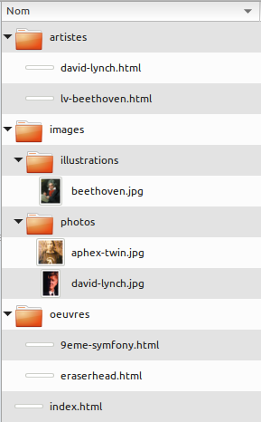
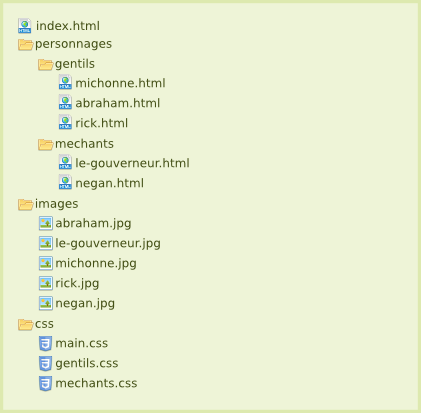

% TP2 : Gestion de site
% Technologies du web
% Stéphane Bouvry, 2014

# Objectif

- Créer un site simple avec plusieurs pages web et des images
- Comprendre et utiliser les URL

# URL

## URL absolues et relatives

Voici une liste d’URL, indiquez si elles sont relatives ou absolues. Si elles ne sont pas des URL, expliquez pourquoi, si vous avez des doutes, vous pouvez consulter l’article très complet disponible sur wikipedia <http://fr.wikipedia.org/wiki/Uniform_Resource_Locator> :

- http ://www.jacksay.com
- images/fichier.jpg
- ../
- ftp ://ftp.jacksay.com/archive.zip
- facebook.com
- https://www.google.com
- cours.jacksay.com
- http ://www.jacksay.com:80/fichier.html
- ../../images/fichier.jpg
- //jquery.com
- http ://identifiant :motdepasse@serveur :8080/fichier.html
- pouet
- images/oops/../archives/../../index.html

<div class="information">
**Avancés** Essayez de déterminer le nom du fichier retourné par ces URL.
</div>


## URL relatives

Pour l'abrorescence suivante, rédigez les **URL relative** pour relier les fichiers entre eux.

<div class="col2">
### Liens à créer
- index.html > 9eme-symfony.html
- index.html > beethoven.jpg
- index.html > lv-beethoven.html
- lv-beethoven.html > beethoven.jpg
- lv-beethoven.html > david-lynch.html
- lv-beethoven.html > 9eme-symfony.html
- lv-beethoven.html > index.html
- david-lynch.html > eraserhead.html
- david-lynch.html > index.html
- david-lynch.html > david-lynch.jpg
- 9eme-symfony.html > lv-beethoven.html
</div>
<div class="col2">

</div>

## Ancres

Créez un fichier HTML contenant une série d’articles contenant les définitions (succinctes) d'acronymes sous la forme : 

```html
<article>
	<h2>ACRONYME</h2>
	<p>Signification</p>
</article>
```

Vous Ajouterez un article pour chaques acronymes ci-dessous (vous pouvez faire des copier/coller depuis Wikipedia) : 

- URL
- HTML
- XHTML
- CSS
- W3C
- SEO
- HTTP
- IP
- FTP
- WWW
- WYSIWYG
- RWD
- WHATWG

Placez ensuite une table des matières en haut de la page donnant un accès rapide à chaque définition.

<div class="information">
**Avancés** Ajoutez au niveau de chaque article un lien "retour au sommaire" permettant de retourner à la table des matières.
</div>


# Synthèse : Mini site

Réalisez un mini-site présentant les personnages du comics *The Walking Dead*.

Reproduisez l'abrorescence ci-dessous en complétant les fichiers avec au minimum : 

- Un titre avec le nom du personnage
- Une image
- Un texte de présentation

Toutes les pages intègreront le fichier CSS `main.css`, ensuite, les méchants intégerons le fichier `mechants.css` et les gentils le fichier `gentils.css`.

Ajoutez ensuite un menu dans chaque page permettant de naviguer d'une page à l'autre. Vous finaliserez enfin le site en produisant une page d'accueil contenant les portraits des personnages avec un lien vers leur page respective.




