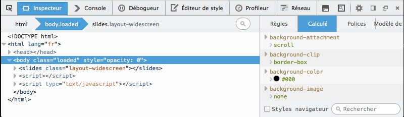
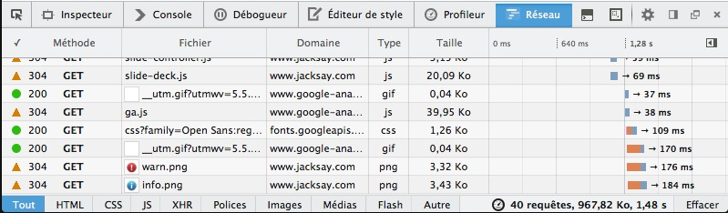

% TP2 : Gestion de site
% Technologies du web
% Stéphane Bouvry, 2014

# Objectif

- Créer un site simple avec plusieurs pages web et des images
- Comprendre et utiliser les URL

## Diapos

- URL : <http://goo.gl/ZOh2mX>

# Liens hypertextes et images

Les URL permettent de localiser une ressource (fichier HTML, CSS, images, vidéos, etc...). Si la localisation est sur le réseaux, on parlera d'**URL absolue**, par exemple : `https://www.google.fr/intl/fr/about/`. Si la localisation est exprimée par rapport à une autre ressource, on parlera d'**URL relative**.

## Relier 2 fichiers avec des liens

Dans cet exemple, nous utiliserons des **URL relatives** pour relier 2 fichiers entre eux. Créez 2 fichiers au même niveau (dans le même dossier) avec ces contenus : 

`page1.html` : 
```html
<!DOCTYPE html>
<html>
<head>
	<meta charset="utf-8" />
	<title>Page 1</title>
</head>
<body>
	<nav>
		<a href="page2.html">Vers page 2</a>
	</nav>
	<h1>PAGE 1</h1>
</body>
</html>
```

`page2.html` : 
```html
<!DOCTYPE html>
<html>
<head>
	<meta charset="utf-8" />
	<title>Page 2</title>
</head>
<body>
	<nav>
		<a href="page1.html">Vers page 1</a>
	</nav>
	<h1>PAGE 2</h1>
</body>
</html>
```
### Exercice

Ajouter un fichier `page3.html` contenant des liens vers `page1.html` et `page2.html`. Pensez à modifier ces dernières pour ajouter le lien vers `page3.html`.

## Images

Les images utilisent également les URL. Pour afficher une image dans une page HTML, on utilise la balise ``

Copiez une image JPEG de votre choix dans un dossier, renommez l'image `mon-image.jpg`. Dans ce même dossier, créez un fichier HTML avec ce code : 

```html
<!DOCTYPE html>
<html>
<head>
	<meta charset="utf-8" />
	<title>Afficher une image</title>
</head>
<body>
	<h1>Afficher une image</h1>
	<p>Paragraphe</p>
	<figure>
		
		<figcaption>Mon image</figcaption>
	</figure>
	<p>Paragraphe</p>
</body>
</html>
```

Quand l'image est une illustration, on place généralement la balise `img` dans une `figure`, `figure` étant une balise de type *block*, elle provoquera un retour à la ligne.

<div class="information">
La balise `img` est une balise de type `inline`. Sans intervention CSS, elle ne provoquera pas de rupture dans le flux. Essayez d'ajouter ce code au fichier : 
```html
<p>
	J'affiche un smiley 
	 
	au milieu du texte
</p>
```
</div>

## Outils de développement

### Inspecteur

Les outils de développement des navigateurs permettent de surveiller l'activité réseaux du navigateur. Pour l'activer dans Firefox, allez dans le menu **Développement > Outils de développement**.



Par défaut, l'outil de développement s'ouvre sur **l'inspecteur**. Ce dernier permet d'analyser et manipuler le code HTML d'un document (partie de gauche) et de visualiser et modifier dynamiquement le code CSS (partie droite).

<div class="information">

Les outils de développement sont très pratiques pour corriger les styles CSS d'un document. Garder à l'esprit que les modifications apportées via l'inspecteur ne s'appliquent pas aux fichiers mais uniquement en mémoire, toute modification sera perdue à l'actualisation.

</div>

### Réseau

Cliquez sur l'onglet **Réseau** dans l'outils de développement. Si l'activité réseau ne s'affiche pas, actualisez votre document.



Vous verrez s'afficher toutes les requêtes HTTP émisses depuis le navigateur. Cet outils permet de contrôler les réponses (en cas de fichier manquant par exemple, erreur 404). Les requêtes peuvent être filtrées par type, durée d'exécution, poids, etc...


## URL absolues et relatives

Voici une liste d’URL ; indiquez si elles sont relatives ou absolues. Si elles ne sont pas des URL, expliquez pourquoi, si vous avez des doutes, vous pouvez consulter l’article très complet disponible sur wikipedia <http://fr.wikipedia.org/wiki/Uniform_Resource_Locator> :

- http://www.jacksay.com
- images/fichier.jpg
- ../
- ftp ://ftp.jacksay.com/archive.zip
- facebook.com
- https://www.google.com
- cours.jacksay.com
- http ://www.jacksay.com:80/fichier.html
- ../../images/fichier.jpg
- //jquery.com
- http ://identifiant:motdepasse@serveur:8080/fichier.html
- pouet
- images/oops/../archives/../../index.html

<div class="information">
**Avancés** Essayez de déterminer le nom du fichier retourné par ces URL.
</div>

## URL relatives

Pour l’arborescence suivante, rédigez les **URL relative** pour relier les fichiers entre eux.

<div class="col2">
### Liens à créer
- index.html > 9eme-symfony.html
- index.html > beethoven.jpg
- index.html > lv-beethoven.html
- lv-beethoven.html > beethoven.jpg
- lv-beethoven.html > david-lynch.html
- lv-beethoven.html > 9eme-symfony.html
- lv-beethoven.html > index.html
- david-lynch.html > eraserhead.html
- david-lynch.html > index.html
- david-lynch.html > david-lynch.jpg
- 9eme-symfony.html > lv-beethoven.html
</div>
<div class="col2">

</div>

<hr class="clearer" />

## Ancres

Créez un fichier HTML contenant une série d’articles avec les définitions (succinctes) d'acronymes sous la forme : 

```html
<article>
	<h2>ACRONYME</h2>
	<p>Signification</p>
</article>
```

Vous y ajouterez un article pour chaque acronyme ci-dessous (vous pouvez faire des copier/coller depuis Wikipedia) : 

- URL
- HTML
- XHTML
- CSS
- W3C
- SEO
- HTTP
- IP
- FTP
- WWW
- WYSIWYG
- RWD
- WHATWG

Placez ensuite une table des matières en haut de la page donnant un accès rapide à chaque définition.

<div class="information">

**Avancés** Ajoutez au niveau de chaque article un lien "retour au sommaire" permettant de retourner à la table des matières.

</div>


# Synthèse : Mini site

Réalisez un mini-site présentant les personnages du comics *The Walking Dead*.

Reproduisez l'abrorescence ci-dessous en complétant les fichiers avec au minimum : 

- Un titre avec le nom du personnage
- Une image
- Un texte de présentation

Toutes les pages intègreront le fichier CSS `main.css`, ensuite, les méchants intégerons le fichier `mechants.css` et les gentils le fichier `gentils.css`.

Ajoutez ensuite un menu dans chaque page permettant de naviguer d'une page à l'autre. Vous finaliserez enfin le site en produisant une page d'accueil contenant les portraits des personnages avec un lien vers leur page respective.


