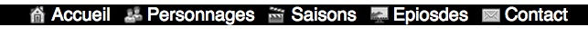

% TP3 : CSS
% Technologies du web
% Stéphane Bouvry, 2014

# Objectif

- Utilisation des CSS

# Diapos

- CSS : <http://goo.gl/1A5eiR>
- URL : <http://goo.gl/ZOh2mX>

## Classes CSS

Les classes CSS sont les plus utilisées en production. Elles permettent de définir des styles indépendament des balises auquels on les applique.

Pour déclarer une classe CSS, on utilise `.nomDeLaClasse` où *nomDeLaClasse* est un nom de votre choix. Ce nom ne peut pas commencer par un nombre et doit être composé de minuscules, majuscules, nombres (les tirets et les underscore sont autorisés). Par exemple : `mon-style`, `monStyle` ou `mon_stye`.

Exemple de déclaration : 

```css
.texte-en-rouge {
	color: #DD0000;
}

.fond-vert{
	background-color: #00DD00;
}
```

Dans cet exemple, nous avons déclaré 2 classes CSS. Nous pouvons maintenant les utiliser sur n'importe quel élément du HTML en utilisant l'attribut `class` :

```html
<section>
	<article>
		<h1 class="texte-en-rouge">TEXTE en ROUGE</h1>
		<p class="fond-vert">Fond en vert</p>
	</article>	
</section>
```

On peut également appliquer plusieurs classes CSS à un même élément en renseignant l'attribut `class` avec toutes les classes séparées par des espaces : 

```html
<section>
	<nav class="texte-en-rouge fond-vert">
		<a href="">LIEN 1</a>
		<a href="">LIEN 2</a>
	</nav>

	<article>
		<h1 class="texte-en-rouge">TEXTE en ROUGE</h1>
		<p class="fond-noir">Fond en vert</p>
	</article>	
</section>
```

## Mise en forme

CSS permet de gérer la mise en forme des documents HTML, dans cette partie, Vous allez devoir réaliser un menu horizontal.

<div class="information">
Vous pouvez vous rendre sur le site <https://developer.mozilla.org/fr/> pour trouver des exemples pour l'utilisation des propriétés CSS évoquées dans la suite du document.
</div>

### Exercice

#### Menu simple

A partir du code HTML suivant : 

```html
<nav>
	<a href="#">Accueil</a>
	<a href="#">Personnages</a>
	<a href="#">Saisons</a>
	<a href="#">Epiosdes</a>
	<a href="#">Contact</a>
</nav>
```

Créez un code CSS pour générer le menu suivant : 


Voici quelques propriétés CSS utiles pour le réaliser : 

- text-align
- background-color
- text-decoration
- font-family
- padding


#### Icônes

Modifiez ensuite le HTML en ajoutant des classes à chaques items du menu, 

```html
<nav>
	<a href="#" class="accueil">Accueil</a>
	<a href="#" class="personnages">Personnages</a>
	<a href="#" class="saisons">Saisons</a>
	<a href="#" class="episodes">Epiosdes</a>
	<a href="#" class="contact">Contact</a>
</nav>
```

puis créez les classes CSS correspondantes pour ajouter des icônes aux items du menu : 



Vous pouvez utiliser le site <http://www.inconfinder.com> pour trouver des icônes adaptés. Dans ce cas de figure, le format PNG permettra de gérer correctement le rendu des icones avec différentes couleurs d'arrière-plan.

Voici d'autres propriétés CSS utiles pour réaliser cette étape : 

- background-image
- background-position
- background-repeat
- padding-left

#### Effet

Dans le cadre de la réalisation d'un menu de ce type, il peut être interessant de souligner l'interactivité en ajoutant un effet au survolle.

CSS permet ce genre de rendu avec le **pseudo selecteur `:hover`**.

Vous voulez essayer d'ajouter cette régle à votre fichier CSS : 

```css
nav a:hover {
	background-color: #ff6600;
} 
```

<div class="information">

Ce type d'effet n'est pas spécifique au liens hypertextes, le pseudo selecteur `:hover` peut être utilisé sur n'importe quel élément.

</div>

# Propriétés usuels

Lors de la production de style CSS, beaucoup de propriétés entre en jeu pour produire l'effet visuel souhaité. Voici quelques propriétés que vous devez maitriser pour obtenir le rendu que vous désirez.

## Margin, padding et border

Pour comprendre la différence entre `margin` et `padding`, créez un fichier HTML : 

```html
<!DOCTYPE html>
<html>
<head>
	<meta charset="utf-8" />
	<title>Margin et Padding</title>
	<link rel="stylesheet" href="margin-padding.css" />
</head>
<body>
	<div class="exemple">
		Contenu
	</div>
</body>
</html>
```

Puis dans le fichier CSS **margin-padding.css** : 

```css
.exemple {
	background-color: #FF6600;
}
```

Vous verrez la `div` s'afficher avec un fond orange et le contenu texte de la `div` à l'intérieur. La zone orange est appelée par les intégrateurs web **une boîte**.

### Padding

La propriétés CSS `padding` permet de gérer l'espace entre le bord de la boîte et le contenu de la boîte.

```css
.exemple {
	background-color: #FF6600;
	/* Espace entre le bord et le contenu */
	padding: 20px;
}
```

Vous pouvez régler également les `padding` individuellement en précisant la direction : 

```css
.exemple {
	padding-top: 25px; /* padding en haut */
	padding-right: 20px; /* padding à droite */
	padding-bottom: 25px; /* padding en bas */
	padding-left: 25px; /* padding à gauche */
}
```

Une forme compactée permet de régler 4 `padding` en utilisant plusieurs valeurs séparées par des espaces : 

**4 valeurs**, réglage haut, droite, bas, gauche : 

```css
.exemple {
	/* haut, droite, bas, gauche */
	margin: 10px 25px 0px 50px;
}
```

**3 valeurs**, réglage haut, droite et gauche, bas :

```css
.exemple {
	/* haut, droite et gauche, bas */
	margin: 10px 25px 0px;
}
```

**2 valeurs**, réglage haut et bas, droite et gauche :

```css
.exemple {
	/* haut et bas, droite et gauche */
	margin: 10px 25px;
}
```


### Margin

La propriétés CSS `margin` va elle gérer l'espace autour de la boîte :

```css
.exemple {
	background-color: #FF6600;
	/* Espace entre le bord et le contenu */
	padding: 20px;

	/* Espace autour de la boîte */
	margin: 50px;
}
```

Comme pour `margin`, `padding` dispose de forme compactée avec plusieurs valeurs séparées par des espaces ainsi que les formes individuelles `margin-top`, `margin-right`, `margin-bottom` et `margin-left`.

### Border

Enfin, la propriété `border` va permet de régler la bordure de la boîte, cette propriété ne prend pas une valeur, mais 3 valeurs séparées par un espace. Ces 3 valeurs correspondent respectivement à l'aspect de la bordure, la taille de la bordure et la couleur : 

```css
.exemple {
	background-color: #FF6600;
	/* Espace entre le bord et le contenu */
	padding: 20px;

	/* Espace autour de la boîte */
	margin: 50px;

	/* Bordure */
	border: solid 8px #990000;
}
```

La taille de la bordure peut être exprimée en `em` ou en pixels. Concernant les bordures, il existe également une valeur spéciale : `thin`. Cette valeur appliquera la taille minimum visible.

La couleurs comme les couleurs classiques (mots-clefs ou valeur hexadécimale).

Voici les différentes apparences possibles : 

- `solid` : plein (normal)
- `dashed` : tirets 
- `dotted` : pointillés
- `double` : 2 liserés espacé (l'espace correspond à la taille de la bordure)
- `groove` : effet ~~moche~~ gravure
- `inset` : effet creusé
- `outset` : effet relief
- `ridge` : gravure en relief

Comme pour `margin` et `padding`, `border` dispose de forme individuelles et compacté. Plus d'information sur cette page <https://developer.mozilla.org/fr/docs/Web/CSS/border>

# Effets visuels

L'apparence des boîtes peut être ajustée avec différentes propriétés : 

## border-radius

Arrondis des angles

```css
.exemple {
	border-radius: 16px;
}
```

On peut utiliser plusieurs valeurs séparées par des espaces pour utiliser des arrondis différents : <https://developer.mozilla.org/fr/docs/Web/CSS/border-radius>

## Ombre externe


### Externe

```css
.exemple {
	box-shadow: -8px 8px 16px 4px #000000;
}
```

La première valeur correspond au décalage en X, la deuxième au décalage Y, la troisième à la taille de l'effet de fondu, la 4ème l'épaisseur (facultative) et enfin la couleur.

### Interne

Même principe, sauf qu'on précède les réglages de l'ombre avec le mot clef `inset` :

```css
.exemple {
	box-shadow: inset -8px 8px 16px #000000;
}
```

### Mixte

Vous pouvez appliquer plusieurs ombres (interne ou externe) et listant les réglages séparés par une virgules : 

```css
.exemple {
	box-shadow: inset -8px 8px 16px #000000, -8px 8px 16px #000000;
}
```


# Maîtriser les sélecteurs


## Rédiger des sélecteurs

Soit le fichier HTML suivant : 

```html
<!DOCTYPE html>
<html>
<head>
	<meta charset="utf-8" />
	<title>Ma page web</title>
</head>
<body>
	<div id="container">
		<header>
			<h1>The Walking dead</h1>
			<p>Comics book</p>
			<nav>
				<a href="index.html">Accueil</a>
				<a href="personnages.html">Personnages</a>
				<a href="comics.html">Les comics</a>
				<a href="contact.html">Contact</a>
			</nav>
		</header>
		<main>
			<!-- Les personnages -->
			<section id="personnages">
				<h2>Personnages</h2>
				<article class="personnage">
					<h3>Rick</h3>
					<p>Lorem ipsum</p>
					<a href="personnages/rick.html">Lire la suite</a>
				</article>
				<article class="personnage">
					<h3>Michonne</h3>
					<p>Lorem ipsum</p>
					<a href="personnages/michonne.html">Lire la suite</a>
				</article>
			</section>

			<!-- Les comics -->
			<section id="comics">
				<h2>Comics</h2>
				<article class="comics">
					<h3>Livre 1 : Passé décomposé</h3>
					<p>Lorem ipsum</p>
					<a href="personnages/livre-1.html">Lire la suite</a>
				</article>
				<article class="comics">
					<h3>Livre 2 : Cette vie derrière nous</h3>
					<p>Lorem ipsum</p>
					<a href="personnages/livre-2.html">Lire la suite</a>
				</article>
			</section>
		</main>
		<footer>
			Copyright &copy; Jacksay.com
		</footer>
	</div>
</body>
</html>
```

Pour le fichier HTML donné et sans y apporter de modification, écrivez les déclarations CSS permettant de :

- mettre le fond du site en gris foncé,
- mettre tous les textes en gris clair,
- L’arrière-plan du titre du site en rouge et le texte en blanc,
- supprimer le soulignement des liens du menu principal,
- mettre le contenu des articles sur les personnages en blanc sur noir, 
- mettre le contenu des articles sur les comics en rouge sur noir,
- mettre le texte du pied de page en caractère 8px,
- afficher les titres des articles en majuscules,
- afficher les liens "lire la suite" avec un aspect bouton,
- afficher la baseline du site en italique,

## Déduction

Le sélecteur CSS `article p` correspond au code source HTML suivant : 

```html
<article> 
	<p>toto</p>
</article>
```

De la même façon, écrivez pour les sélecteurs suivants, le code HTML (minimale) correspondant.

- a
- article h1
- \#contenu
- .important
- section.actualites article h1
- main section article.ancien
- section article.stickly a
- header.bandeau nav a
- article.nouveau.truc
- article.nouveau header h1
- main section.actualites section.culture article.art footer p.auteur strong

