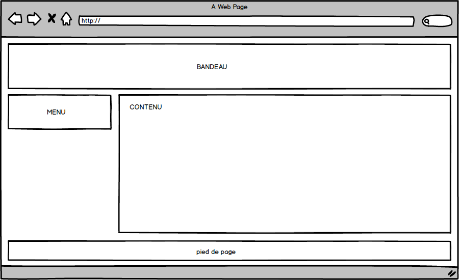
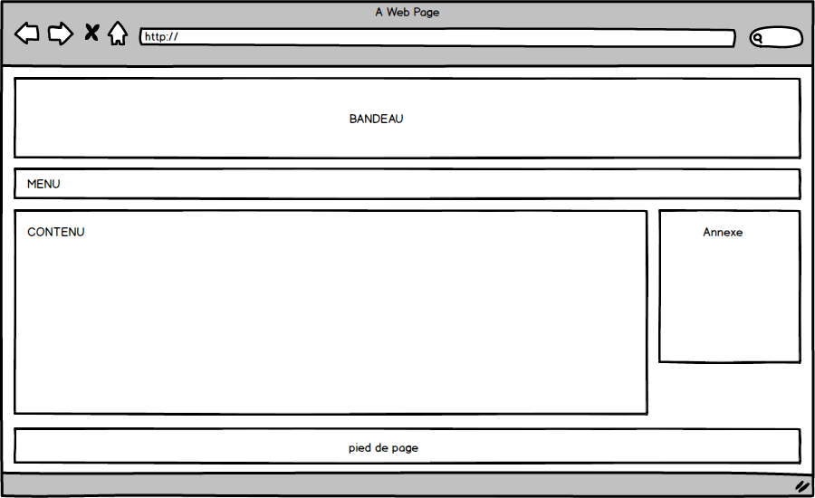
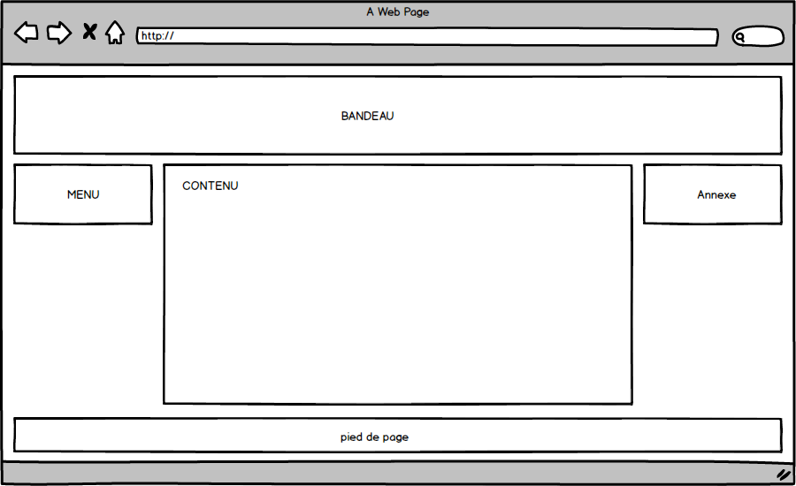
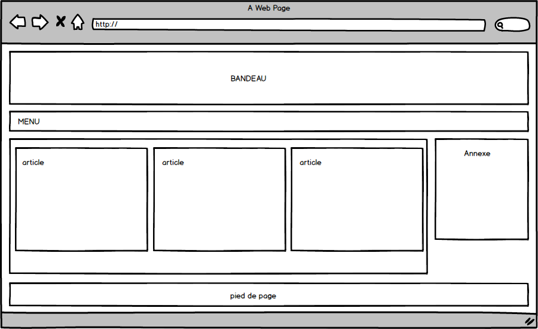

% TP4 : Mise en page
% Technologies du web
% Stéphane Bouvry, 2014

# Objectif

- Utilisation de CSS pour la mise en page

# Diapos

- Diapos sur Float : <http://goo.gl/aVaQiU>

# Comprendre float

## Préparation

Ce petit exercice vise à mettre en lumière le fonctionnement de la propriété `float`.

Commencez par créer 2 fichiers : 

- float.html
- float.css

Modifier le fichier HTML de cette façon : 

```html
<!DOCTYPE html>
<html>
<head>
	<meta charset="utf-8">
	<title>Float</title>
	<link href="float.css" rel="stylesheet" />
</head>
<body>
	<aside>
		ASIDE
	</aside>
	<section>
		SECTION
	</section>
</body>
</html>
```

Puis modifiez le fichier CSS de cette façon : 

```css
body {
	padding: 10px;
	background-color: #CCC;
}

aside {
	background-color: tomato;
}

section {
	background-color: olive;
}
```

## Float

Pour le moment, rien de très transcendant. Faites maintenant flotter à gauche le `aside` en utilisant la propriété `float` : 

```css
aside {
	background-color: tomato;
	float: left;
}
```

Première chose à savoir sur `float`, **l'élément flottant prend la largeur de son contenu** si cette largeur n'est pas fixée avec la propriété `width`. Ajouter quelques caractère en plus dans l'`aside`, vous verrez sa largeur augmenter en conséquence. 

A l'origine, cette propriété CSS était destinée à faire "couler" du texte autour des images. Si vous ajouter beaucoup de texte dans la div `section`, vous verrez le texte "couler" autour de l'aside.

```html
<section>
	SECTION Lorem ipsum dolor sit amet, consectetur adipisicing elit. Ipsa eius ipsum officiis animi eaque. Rerum tempora, voluptas nihil quasi veritatis ad corporis. Sequi ab quis laudantium, animi, numquam magni nulla!
</section>
```

L'ajout du texte permet également de constater un autre effet de la propriété `float` : **L'élément flottant sort du flux**. En effet, on voit que l'`aside` semble être passé au dessus de la section. C'est le cas. La `section` est remontée comme si l'`aside` n'était pas là.

<div class="attention">
L'élément `section` est remonté, et c'est son contenu qui s'écoule.
</div>

## Mise en page avec float

Essayons maintenant d'obtenir un rendu type colonne avec l'`aside` et la `section`. Pour cela, commençons par fixer les largeurs de la `section` et de l'`aside` : 

```css
aside {
	background-color: tomato;
	float: left;
	width: 30%;
}

section {
	background-color: olive;
	width: 70%;
}
```

La logique voudrait que la `section` et l'`aside` se place côte à côte. Ce n'est pas le cas. Souvenez vous bien. L'`aside` est sorti du flux, la section continue donc de se positionner comme si l'`aside` n'était pas là.

Lorsqu'un élément flotte à gauche, **le contenu des éléments** qui suivent s'écoule à droite, et les éléments remontent... 

...Sauf si les éléments qui suivent flottent dans la même direction. Essayez : 

```css
section {
	background-color: olive;
	width: 50%;
	float: left;
}
```

Vous devriez voir l'aside et la section se placer l'un à côté de l'autre. Notre effet colonne semble au point.

## Clear

Malheureusement, nous n'avons pas terminé. Souvenez vous. Le contenu des éléments non-flottant qui suivent va s'écouler à droite. Ajouter dans le HTML une div avec du texte dedans : 

```html
<aside>
	ASIDE
</aside>
<section>
	SECTION Lorem ipsum dolor sit amet, consectetur adipisicing elit. Ipsa eius ipsum officiis animi eaque. Rerum tempora, voluptas nihil quasi veritatis ad corporis. Sequi ab quis laudantium, animi, numquam magni nulla!
</section>
<div>
	Lorem ipsum dolor sit amet, consectetur adipisicing elit. Labore totam aut aliquam eaque, sint dignissimos! Esse expedita adipisci quaerat maxime illum dolores officia perferendis nesciunt, neque, autem, facilis illo inventore.
</div>
```

Vous devriez voir le texte de la div s'écouler à droite de la `section`.

Souvenez vous également que la `div` est remontée. Dans notre cas, elle n'a pas de fond donc nous ne voyons pas encore ce phénomène, ajoutons lui un arrière plan : 

```css
div {
	background: purple;
}
```

Pour régler le problème, on pourrait ajuster la largeur de l'`aside` et de la `section` : 

```css
section {
	background-color: olive;
	width: 70%; /* aside de 30 + 70 = 100% */
	float: left;
}
```

Mais cette solution, même si elle est fonctionnelle n'est pas satisfaisante. En effet, la div continue de remonter. Il faudrait qu'à partir de la div, le flottement s’arrête.

C'est là qu'intervient la propriété CSS `clear`. Cette propriété permet d'interrompre le flottement, une façon de dire "a partir de la, ça ne flotte plus".

Ajouter un `<hr />` entre la `section` et l'`div`, puis éditez le CSS en plaçant la propriété `clear` sur le `hr` : 

```css
hr {
	clear: both;
}
```

Le problème est réglé.

## Technique du *clearer*

Depuis plus de 10 ans, les webmasters utilisent différentes techniques pour gérer le flottement et son interruption. La première est la technique du *clearer*.

Il s'agit d'une simple classe CSS qui va gérer le `clear: both` et rendre invisible le `hr`. Pour cela on crée un classe CSS (on la nomme *clearer* par convention) : 

```css
.clearer {
    border: none;
    clear: both;
    height: 0;
    margin: 0;
    padding: 0;
}
```

Supprimez la régle sur le `hr` puis ajouter à l'élément `hr` la classe `clearer` : 

```html
<hr class="clearer" />
```

## Technique du *clearfix*

Cette autre technique a été inventé par Tony Aslett. Elle est actuellement la plus utilisée dans les grilles de mise en page dans l'industrie des *framework* CSS.

Par contre, elle nécessite d'enrober les éléments qui flottent dans une `div` qui gérera l'interruption du flottement.

```css
.clearfix:after {
    content: ".";
    display: block;
    height: 0;
    clear: both;
    visibility: hidden;
}
```

Puis côté HTML : 

```html
<div class="clearfix">
	<aside>ASIDE</aside>
	<section>SECTION</section>
</div>
```

# Entraînez-vous

Essayez de reproduire les mise en page suivante en utilisant `float` : 










