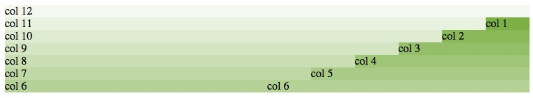
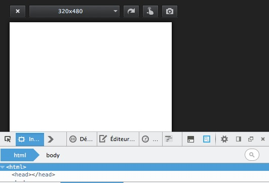
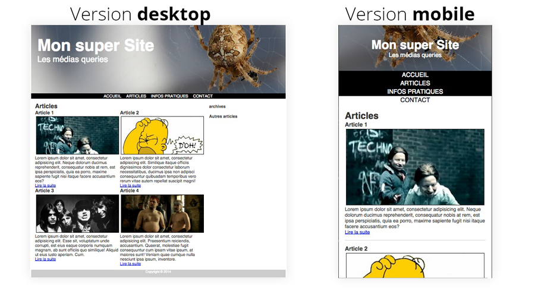

% Responsive Design
% Technologies du web
% Stéphane Bouvry, 2014

# Objectif

- Utilisation de CSS pour la mise en page

# Diapos

- Le responsive design : <http://goo.gl/dMH8IS>

# Grille fluide

Dans cette partie, nous allons créer pas-à-pas notre propre grille fluide.

### Préparation

Créez 2 fichiers : 

- grid.html
- grid.css

La grille que nous allons réaliser permettra de diviser l'espace d'affichage en 12 colonnes. Vous verrez que la somme des colonnes sera toujours égale à 12.

Ajoutez ce code au fichier CSS, il permettra de visualiser les différentes colonne de la grille en mettant une couleur en arrière-plan.

```css
.col12 { background-color: rgba(124,176,69,0.08); }
.col11 { background-color: rgba(124,176,69,0.16); }
.col10 { background-color: rgba(124,176,69,0.24); }
.col9 { background-color: rgba(124,176,69,0.32); }
.col8 { background-color: rgba(124,176,69,0.40); }
.col7 { background-color: rgba(124,176,69,0.48); }
.col6 { background-color: rgba(124,176,69,0.56); }
.col5 { background-color: rgba(124,176,69,0.64); }
.col4 { background-color: rgba(124,176,69,0.72); }
.col3 { background-color: rgba(124,176,69,0.80); }
.col2 { background-color: rgba(124,176,69,0.88); }
.col1 { background-color: rgba(124,176,69,1); }
```

Vous pourrez le supprimer une fois la grille prête.

### La grille

Ajoutez maintenant ce code au HTML : 

```html
<div class="row">
    <div class="col6">col 6</div>    
    <div class="col6">col 6</div>
</div>
```

La classe CSS `row` sera utilisée pour faire un **clearfix** (voir diapos sur la mise en page)

Puis modifier ensuite le CSS pour obtenir un affichage en colonne en utilisant la technique des `float` comme nous l'avons vu dans les ateliers précédents. Vous ajusterez la largeur des colonnes **en pourcent**.

Modifiez ensuite le fichier HTML en ajoutant ce code, et complétez le CSS : 

```html
<div class="row">
    <div class="col6">col 6</div>    
    <div class="col3">col 3</div>
    <div class="col3">col 3</div>
</div>
```

puis ajoutez : 

```html
<div class="row">
    <div class="col4">col 4</div>    
    <div class="col4">col 4</div>
    <div class="col4">col 4</div>
</div>
```

Voici enfin le code HTML complet à faire fonctionner : 

```html
<div class="row">
    <div class="col12">col 12</div>  
</div>
<div class="row">  
    <div class="col11">col 11</div>
    <div class="col1">col 1</div>
</div>
<div class="row">  
    <div class="col10">col 10</div>
    <div class="col2">col 2</div>
</div>
<div class="row">  
    <div class="col9">col 9</div>
    <div class="col3">col 3</div>
</div>
<div class="row">  
    <div class="col8">col 8</div>
    <div class="col4">col 4</div>
</div>
<div class="row">  
    <div class="col7">col 7</div>
    <div class="col5">col 5</div>
</div>
<div class="row">
    <div class="col6">col 6</div>    
    <div class="col6">col 6</div>
</div>
```

Vous devrez obtenir le résultat suivant : 



<div class="information">
Lors de l'affectation de la largeur, il est recommandé d'utiliser de longues décimal par exemple : 
```css
.col5 {     
    width: 41.666666666666665%;
}
```
</div>

# Medias queries

Les *medias queries* sont des blocs de code CSS qui ne vont s'appliquer qu'en fonction de certaines conditions.

Elles se pésentent sour la forme : 

```
@media <CONDITION> {
    /* Règles CSS si <CONDITION> est vrai */
}
```

Les *medias queries* sont utilisées pour faire du **Responsive Design** (Web adaptatif) afin d'adapter la mise en page des documents Web à la taille de l'écran.

Produisez le HTML suivant : 

```html
<div>
    <span class="petit">PETIT</span>
    <span class="moyen">MOYEN</span>
    <span class="grand">GRAND</span>
</div>
```

Le code qui suit va permettre de modifier la couleur de fond des `span` en fonction de la largeur de l'écran.

```scss
/* largeur jusqu'à 480px */
@media (max-width: 480px) {
    .petit {
        background: #FF6600;
    }
}

/* Entre 481px et 800 (exclus) */
@media (min-width: 481px) and (max-width: 799px) {
    .moyen {
        background: #FF6600;
    }
}

/* 800 et plus */
@media (min-width: 800px) {
    .grand {
        background: #FF6600;
    }
}
```

### Exercice

Modifier le HTML de cette façon : 

```html
<div>
    <span class="petit">PETIT</span>
    <span class="moyen">MOYEN</span>
    <span class="grand">GRAND</span>
    <span class="tresgrand">TRES GRAND</span>
</div>
```

Puis modifier le CSS pour obtenir les effets suivant : 
 
- Le `span` correspondant a un texte blanc sur fond vert
- Le `span` ne correspondant pas a un texte blanc sur fond rouge

Les tailles doivent correspondrent à : 

- petit : 0 à 480
- moyen : 480 à 768
- grand : 769 à 1167
- très grand : 1168 et plus

#### Web adaptatif dans firefox

Firefox (et chrome sour la forme d'un *addon*) propose un assistant pour visualiser un document web dans différents format. Vous pouvez l'activer dans la barre de développement (icône web adaptatif)



# Synthèse

Téléchargé le ZIP à l'adresse <http://www.jacksay.com/TP/web/tp05/medias-queries.zip> puis modifiez le fichier CSS pour obtenir une version mobile du site comme dans l'aperçu ci-dessous : 



<div class="information">
Dans la version mobile, vous pourrez choisir de cacher l'aside contenant les archives et les autres articles.
</div>

