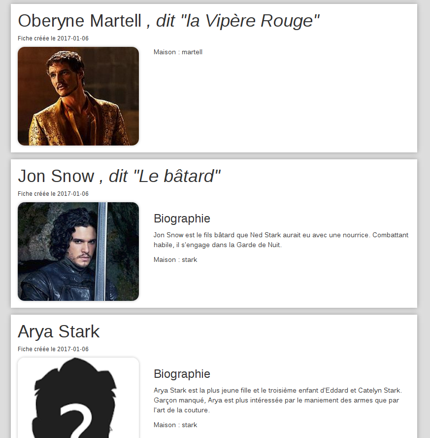
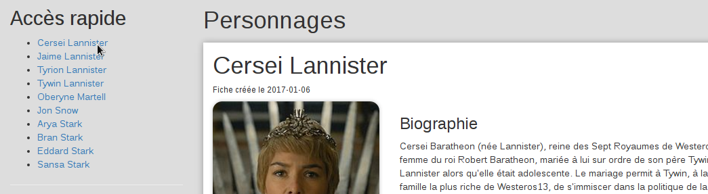
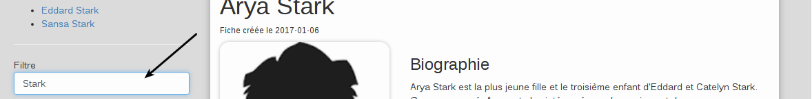
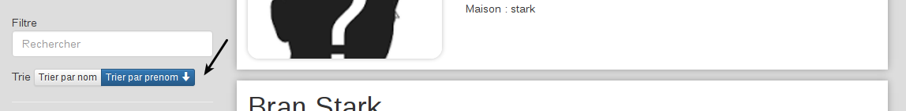
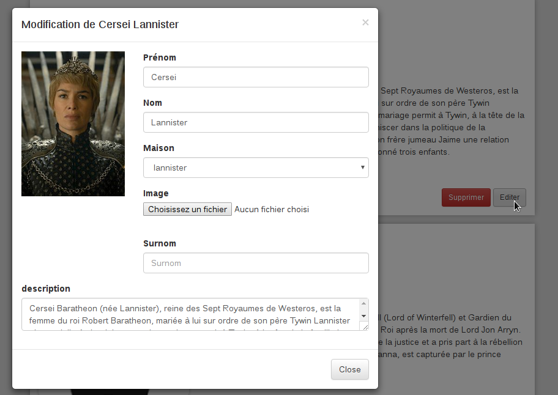

# VueJS

## Présentation

Dans ce premier atelier, vous allez faire connaissance avec VueJS pour la production d'interface web.

L'application sera une interface type liste/fiche permettant de visualiser des fiches personnages de la série *Game Of Thrones*.

### Modèle de donnée

> Dans le cadre de ce TP, un modèle vous sera fournis au format JSON contentant des images au format BASE64. Le fichier étant extrèmement volumineux, certains éditeurs de texte ont souvent un peu de mal à l'ouvrir.

Voici la structure des données du modèle fournis.

```javascript
// Array contenant un objet pour chaque personnage
var personnages = [
  {
    id: "identifiant",
    surnom: "Surnom, vide ou null",
    prenom: "Le prénom",
    nom: "Le nom",
    dateCreated: "2017-01-08",
    image: "data:image/jpeg;base64;/XXXXXXXX",
    maison: "IDMAISON, ID de l'objet maison ou vide",
    description: "La bio du personnage"
  },
  {
    // autre personnage
  }
];

var maisons: {
  IDMAISON: {
    id: "IDMAISON",
    region: "Région",
    capitale: "Capitale",
    devise: "La petite maxime qui va bien"
  },
  "AUTREIDMAISON": {
    // etc...
  }
};
```

Vous pouvez télécharger le fichier contenant des données de test ici [model.js](../ressources/model.js)

## Etape 1 : Liste des personnages

A partir des données fournies et en utilisant **VueJS**(https://vuejs.org/), affichez les informations pour obtenir ce type de résultat. Vous pourrez vous aider d'un *framework* tel que **Bootstrap** pour gérer le rendu et la mise en page.



Si les données ne proposent pas d'image, affichez une image par défaut.


## Etape 2 : Menu d'accès rapide

Ajoutez un menu latéral permettant au click de faire défiler la page sur le personnage correspondant.




## Etape 3 : Recherche

Ajoutez dans le menu latéral un champ de recherche rapide qui permettra de filtrer les personnages sur le nom, le prénom ou le surnom.



## Etape 4 : Tri

Dans le menu latéral, ajoutez un élément d'interface permettant de trier les informations (Par nom, prénom).




**Extra** : Cliquer sur un tri provoque le tri dans l'ordre croissant, cliquer à nouveau trie dans l'ordre décroissant. Essayez de  trouver un dispositif visuel pour indiquer si le tri est croissant ou décroissant.

## Etape 5a : Supprimer

Sur chaque personnage, ajoutez un bouton supprimer fonctionnel

## Etape 5b : Editer

Sur chaque personnage, ajoutez un bouton éditer. Il ouvrira une fenêtre modale contenant un formulaire pour éditer automatiquement (sans bouton enregistrer) le contenu de la fiche correspondant. Dans un premier temps, ne vous occupez pas de l'image.



Dans un deuxième temps et en vous appuyant sur **FileReader**, trouvez une solution pour mettre à jour l'image (indice, c'est du Javascript, rien à voir avec VueJS).

## Etape 6 : Nouveau

Créer une fonctionnalité "Nouveau" permettant d'ajouter un nouveau personnage à la liste.

## Etape 7 : Store

Modifiez le code pour permettre d'enregistrer les informations dans le navigateur en utilisant les LocalStorage. Si le localStorage est vide, application utilisera le jeu de données par défaut.

Vous ajouterez également un bouton permettant de sauvegarder fiches personnages dans un fichier, puis un autre pour les charger les données depuis ce même fichier.

## Extras

Autoriser l'utilisation du format *Markdown* dans la biographie des personnages.

Les plus affuté essayeront de remplacer les "Prénom Nom" de la description par des ancres actives vers la fiche du personnage correspondant.
