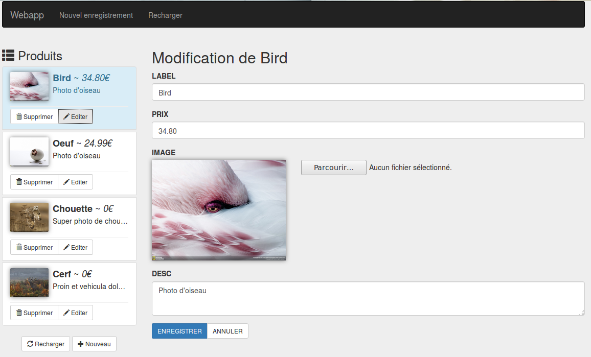

% TP2
% Webapp
% 2017

# Présentation

Les fichiers de départ sont disponibles à cette adresse :
[Archive du TP N°2](../ressources/VueTP2.zip). A partir des fichier fournis, construire une interface graphique pour la gestion de produits.



L'archive contient :

 - Un script serveur `server.php` proposant une API REST basique pour réaliser les tests
 - Un fichier `index.html` qui contiendra l'interface (une partie du code est déjà en place)
 - Un dossier `images` (emplacement où l'API enregistre les images)
 - Un dossier `js` contenant les librairies

Vous utiliserez [Vue-Resource](https://github.com/pagekit/vue-resource) pour gérer l'échange des données entre l'API et l'interface

## Présentation de l'API fournie

L'API se présente sous la forme d'un simple script PHP. C'est une application PHP développée pour les tests uniquement! Elle stoque les données dans le fichiers **datas.txt** et les images dans le dossier **images/**.

Pour lancer l'API, utiliser le terminal, placez vous dans le dossier racine, puis lancez un *built-in server* PHP avec la commande :

```
# Lancer l'API de test
php -S 127.0.0.1:8080 -t ./ server.php
```
Vous pouvez vérifier que le serveur fonctionne bien en testant l'adresse : <http://127.0.0.1:8080/produits/>. Toutes les transmissions reçues par le serveur sont affichées dans la sortie standard.

Voici les points d'accès possibles :

 - `[GET] http://127.0.0.1:8080/produits` Retourne la liste des produits
 - `[POST] http://127.0.0.1:8080/produits` Envoi un nouveau produit à enregistrer, retourne le produit (avec l'ID)
 - `[PUT] http://127.0.0.1:8080/produits/:id` Envoi les modifications pour le produit :id, Retourne le produit à jour
 - `[DELETE] http://127.0.0.1:8080/produits/:id` Supprime le produit :id


L'API ne réalise aucun contrôle sur les données soumises, elle ne sert que pour réaliser des tests.

Vous pouvez remettre à zéro les données en copiant le fichier datas.dist.txt dans datas.txt

```bash
# Remettre les données initiale
cp datas.dist.txt datas.txt
```

# Réalisation

Vous devrez décomposer l'application avec au moins 2 composants, un pour gérer la liste des produits, un autre pour le formulaire. Essayez de centraliser les échanges entre l'interface et l'API dans l'instance de Vue principale.


## Liste (Premier composant)

Vous travaillez sur le fichier <http://127.0.0.1:8080/index.html> qui contient déjà une partie du code.

Vous allez créer un premier composant. Ce composant aura en charge d'afficher une liste de produit. Dans l'ASIDE à gauche.

Récupérer la liste des produits depuis l'API <http://127.0.0.1:8080/produits> et l'affichez sur la gauche. Les communications HTTP peuvent être gérées dans VueJS en utilisant le plugin [Vue-Resource](https://github.com/pagekit/vue-resource).

Pour rappel, les méthodes de VueResource (get, delete, put, etc...) retourne des **Promises** <https://developer.mozilla.org/fr/docs/Web/JavaScript/Reference/Objets_globaux/Promise>.

Vous devez également afficher les éventuels retour d'erreur de l'API. Pour tester un retour d'erreur, utiliser l'URL <http://127.0.0.1:8080/produits/?error=404> (ou autre code d'erreur courant). Si vous affichez un encart d'erreur, pensez à laisser la possibilité à l'utilisateur de le fermer quand il en a pris connaissance. (Évitez les modales).


## Formulaire (Deuxième composant)

En cliquant sur "Nouveau", un formulaire apparaît (vide) dans la zone principale avec un formulaire permettant de créer un nouveau produit. Vous utiliserez le même composant pour éditer les produits existants.

<div class="information">
Vous pouvez dans un premier temps ignorer l'image qui vous demandera plus de temps
</div>

Quand l'utilisateur clique sur "Enregistrer", les données sont envoyées à l'API <http://127.0.0.1:8080/produits> (POST) pour créer et <http://127.0.0.1:8080/produits/ID>(PUT) pour modifier, vous utiliserz VueResource pour envoyer les informations à l'API.

Astuce : Pour l'envoi des données, VueResource gère parfaitement l'objet Javascript `FormData` qui vous aidera beaucoup pour l'envoi de l'image <https://developer.mozilla.org/en-US/docs/Web/API/FormData/Using_FormData_Objects>.


### Améliorations et Aides

#### Surbrillance
Essayez de mettre en évidence dans la liste l'élément en cours d'édition.

#### Mise à jour des modifications

Comme vu précédement, VueJS utilise le *Data Binding* pour mettre à jour en temps réél les vues branchées sur le model. Si vous éditer les données depuis le formulaire, les informations seront actualisées dans la liste automatiquement. Essayé de trouver une solution pour que la mise à jour des données de la liste ne soit appliquée que si les données ont été correctement traitées par le serveur.

Vous pourrez ajouter au passge un bouton "Annuler" dans le formulaire.

#### Aperçu de l'image

Il serait interessant de proposer une *preview* de l'image quand l'utilisateur en choisi une nouvelle. Pour vous aider, on peut détecter l'événement `change` sur un champs `input` et utiliser un `FileReader` pour lire un fichier en **base64**.

### Chargement

Les opérations entre le serveur et le client peuvent parfois être longues, ajoutez dans l'application un écran de chargement pour témoigner de cette activité. pour vous aider, l'API `server.php` permet de configurer le temps de réponse de l'API en seconde (voir en début de fichier l'option `latence`).

### Opération en cours

Lors d'une transmissions, il peut être interessant d'indique à l'utilisateur l'action en cours : Chargement des données, enregistrement des modification, etc...

### Confirmation

Ajouter un écran de confirmation lors de la suppression, vous pouvez vous aider du plugin bootstrap **Bootbox**.


## Routage

Utilisez VueRouter dans l'interface pour permettre la navigation via l'URL.

Profitez en pour ajouter une vue "Fiche" permettant de voir une fiche pour le produit.

Dans un premier temps, assurez vous que le navigation fonctionne toujours en partant de la liste.

Ensuite essayer de faire fonctionner l'écran d'édition/fiche au rechargement complet de la page. Cette étape peut s'avérer plus délicate que le autres.
