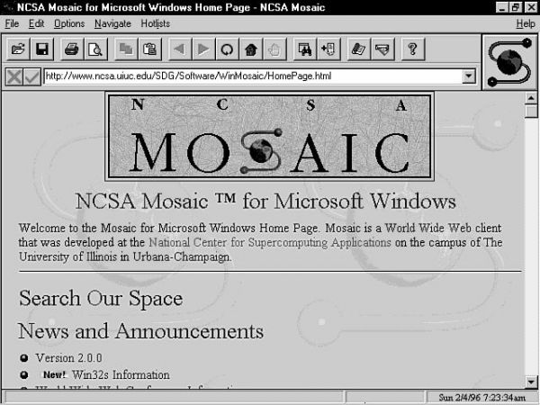
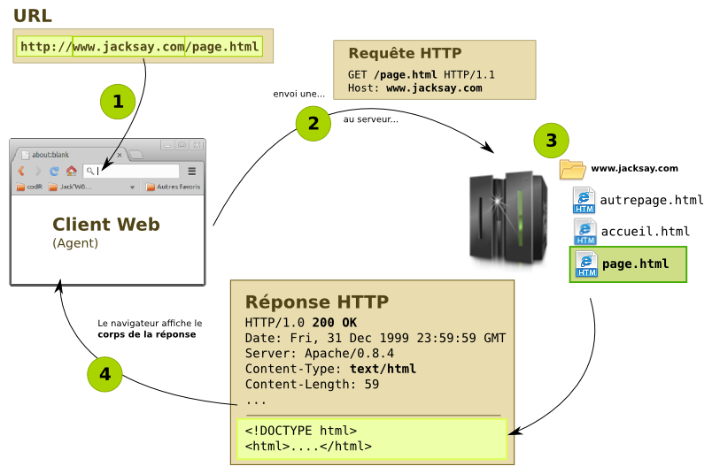
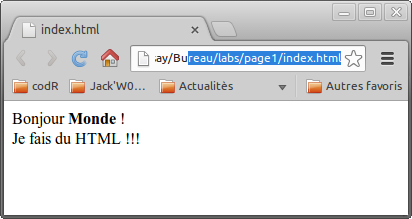
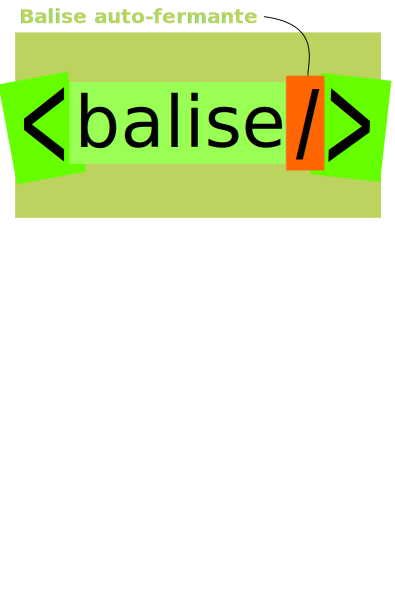
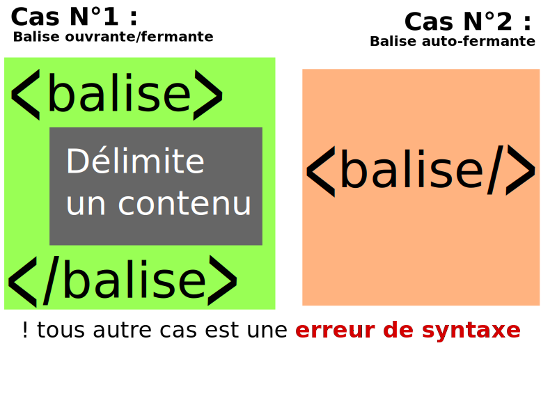

% Débuter avec HTML5
% Stéphane Bouvry
% 2014


# Présentation

HTML, Qu'est ce que c'est ?

---

## Technologie
                                
- Création de document web (page web)
- Application (Web apps)


## Langage

- Langage de description par **balises**
- Conçu pour être simple à utiliser
- Un langage sémantique (Structurer l'information)


## 1990 : Origine {data-background="../images/berners.jpg"}
                                    
**Tim Berners** Pose les bases du web : 
                                               
- 1^er^ navigateur,                            
- le protocol HTTP,         
- et le HTML.

<!--Le terme de **World Wide Web** est déjà consacré.-->
              
## Mosaic Web (1993)
                    
Le Web s'étend à la communauté scientifique et se popularise grâce à **NCSA Mosaic**, un navigateur capable d'afficher... des images.


                
## 1994-96 Boom!

- **Netscape navigator**  popularise le web hors des universités en permettant de réaliser les premiers sites visuels.
- Fondation du **W3C** (World Wide Web Consortium).
- Apparition d'**Internet Explorer**.
- **1995/96** Spécification de HTML 2.0 est publiée.       
                        


## 1997/2000 Industrialisation
                    
                    
                        
**HTML 3.2**
 Syntètise les améliorations apportées 
                        par netscape et Internet explorer
                    
                    
                        
**HTML 4**
 sort dans la foulée. Arrivée en 
                        force des 
**style CSS**
 et des scripts (Javascript).
                    
                       
                    
                    
                        


                    
                
## XHTML et CSS 2 (2000/2008)
                    
                    
                        
**XHTML**
 est la version strict de HTML 4.
                    
                    
                        Il scèle une bonne fois pour toute la sacro-sainte séparation du 
                        contenu (XHTML) et de la forme (CSS). Qui relève également du 
                        bon sens (sauf quand on est pressé).
                    
                       
                    
                    
                        


                    
                
## HTML5 et CSS3 (aujourd'hui)
                    
                    
                        
**XHTML 2**
 est abandonné, rejeté par la communauté 
                        avant même d'être publié.
                    
                    
                        
**HTML5**
 et 
**CSS3**
, encore en 
                        brouillon, sont déjà adoptés par les principaux 
                        navigateurs (Firefox, Chrome, Internet Explorer).
                    
                    
                        C'est l'aire du 
**Web sémantique.**

                    
                       
                    
                    
                        


                    
                
## A retenir
                
                    
**HTML**
 : structure la page web.
                
                    


                    
                        
**CSS**
 : Mise en forme
                
                
                
                    


                    
**Javascript**
 : Interactivité
                
            
# Le World Wide Web
## Principe
                    Le Web (à ne pas confondre avec Internet), repose sur 3 choses : 
                    
                        
- Le 
**navigateur web**
,
                        
- Le 
**protocole HTTP**
,
                        
- et le 
**langage HTML**
.
                    
                    Comme tout les médias, le web, impose des contraintes.
                
## Navigateur
                    Le navigateur permet de consulter des documents sur le web, 
                        selon le 
**moteur de rendu**
, le résultat peut 
                        varier (Surtout sur Internet Explorer < 10)
                    
                    
                    


                    
                
## protocole HTTP
                    
                    


                    
                
## Contraintes du web
                    Quelle sont les contraintes du web ?
                    
                        
- Ergonomie
                        
- Esthétiques
                        
- Structure et architecture des informations
                        
- Marketing et commerciale
                        
- Norme, standard et technique
                        
- Budget
                    
                
## L'ergonomie
                    Un site doit prendre en compte le 
**comportement de l'utilisateur**
 et ces conditions matérielles et accessibilité.
                    Il faut également se rappeler que les internautes ne sont pas tous égaux : 
                    
                        
- Disparités matérielles (écran, support, connexion, navigateur
                        
- Habitudes de la ou les cibles
                    
                
## L'esthétique
                    Un site doit avoir une identité visuelle claire.
                    Les éléments visuels classiques doivent respecter les usages : 
                    
                        
- Barre de menus
                        
- Boutons et champs de saisies
                        
- Lisibilité (tailles de caractères, contrastes)
                        
- Confiance (L'effet amateur, inachevé, "ça bug")
                    
                
## L'architecture
                    L'information doit être organisée dans une page et tout au long de la navigation sur le site.
                    
                        
- Rendre facile l'accès à l'information souhaitée (plan de site, menu, sous-menu) ;
                        
- Organisation des informations dans la page (Mise en page)
                        
- Page d'accueil, la colonne vertébrale du site
                        
- Référencement (Le référencement repose principalement sur le texte)
                    
                
## Le marketing
                    Un site doit répondre à un objectif (commercial).
                    Le critère commercial va déterminer l'importance des autres
                
## Les standards
                    Un site doit respecter les standards et normes de développement, ainsi que des contraintes technique : 
                    
                        
- Accessibilité (Devices, tailles d'écrans, supports)
                        
- Puissance de l'appareil (le client)
                        
- Vitesse de connexion (3G, Wifi publique, latence)
                        
- Performance (site trop lent)
                        
- Référencement
                        
- Sécurité
                    
                
## Le budget
                    Un site doit respecter un budget fixé.
                    
                        
- Utiliser des outils clef-en-main (framework, gabarits) ;
                        
- Utiliser des outils connus ;
                        
- Être correctement référencé sur les moteurs de recherche.
                    
                
# HTML, le langage
## Fichier HTML
                    Le code HTML s'écrit dans des fichiers HTML ; Les fichiers HTML sont de simples fichiers texte.
                    N'importe quel éditeur de texte suffit pour éditer du HTML.
                    Par convention, on utilise l'extention `*.html` (ou `*.htm` pour les puristes) ;
                    Pour tester une page HTML, il suffit de l'ouvrir dans un navigateur ;
                
## Editeurs HTML
                    Pour faire du HTML, il faut un éditeur de texte, pour débuter voici quelques éditeurs très performants : 
                    
                        
- Sublim Text Sublim Text : Le plus populaire chez les développeurs web,
                        
- Notepad++ Notepad ++
                        
- Komodo Edit Komodo Edit
                        
- Bracket Bracket, le petit nouveau, prometteur
                    
                
## Premier contenu
                    Créez un fichier `index.html`, puis entrez ce texte dedans : 
                    

```text
                        Bonjour Monde !
                    
```


                    
                    Puis ouvrez le fichier dans le navigateur : 
                    


                
## Premier contenu (suite)
                    Le 
**code source**
 d'une page web est du simple texte.
                    Ce code source est 
**interprété**
 par le navigateur avant d'être affiché : 
                    Essayez de modifier le fichier de cette façon : 
                    

```text
                        Bonjour <strong>Monde</strong> !<br/>
                        Je fais du HTML !!!
                    
```


                    Donne...
                    


                
## Question ?
                    Peut-t'on considérer que nous avons un site web ?
                    Pourquoi ?
                
# Syntaxe HTML
## Introduction
                    
                        Le 
**code source**
 HTML permet de structurer
                            les informations avec des balises.
                        Les balises sont 
**toujours entourées de chevrons**

                        Dans 99% des cas, un nom de balise est écrit en minuscule et ne contient pas de
                            caractères accentués, ni espaces.
                    
                    
                        


                    
                
## Types de balises
                    On distingues différentes formes de balises : 
                    
                        
- Les balises ouvrantes,
                            ex: `<h1>`, `<p>`, 
                        
- Les balises fermantes, ex: `</h1>`, `</p>`, 
                        
- Les balises orphelines (ou auto-fermantes)ex: `<br />`, 
                    
                
## Balises ouvrantes et fermantes
                    
                        Les balises 
**ouvrantes**
 et 
**fermantes**
 permettent de délimiter
                            du contenu.
                        C'est le cas le plus répandu.
                        

```html
                        <h1>Ce contenu sera un titre</h1>
                        <p>
                            Ce contenu sera un paragraphe,
                            avec
                            <strong>
                                ce texte en gras
                            </strong>
                        </p>
                        
                        
```


                    
                    
                        


                    

                
## Balises auto-fermantes
                    
                        Certaines balises 
**ne délimitent aucune information**

                        Plutôt que de les ouvrir et de le refermer ex : `<balise></balise>`
                        On utilise une syntaxe raccourcie : `<balise/>`

                        

```html
                    <!-- Liseré horizontal -->
                    <hr />

                    Texte avec un<br />
                    Retour à la ligne
                    
                        
```


                    

                    
                        


                    

                
## A retenir

                        



                
## Validation
                    Vous pouvez tester la validité d'un code HTML en utilisant le 
[Validateur W3C]({@href})

                    


                
## Exercice
                    
                        
                            Téléchargez le fichier HTML :
                            
[ICI]({@href})
 ,
                            modifiez le contenu du `BODY` pour obtenir le résultat ci-contre :
                        
                        Vous utiliserez les balises : 
                        
                            
- `h1` pour le titre,
                            
- `h2` pour le sous-titre,
                            
- `p` pour le bloc de texte,
                            
- `br` (Auto-fermante) pour les retour-chariot.
                        
                        Les plus avancés pourront utiliser la balise `strong` pour mettre en évidence
                        l'expression savant astronome dans le texte.
                    
                    
                        


                    

                
# Syntaxe "avancées"
## Règle de base
                    
                        l'enchaînement de balise est appellé l'
**imbrication**

                         

```html
                        <body>
                         <h1>Bonjour monde !</h1>
                         <p>
                          Ceci est ma première page<br/>
                          elle contient du 
                            <strong>HTML</strong> !
                         </p>
                        </body>
                        
```


                        
                            
                                Il est souvent représenté sous la forme d'un arbre (on parle de l'arbre DOM).
                            
                        
                    
                    
                        


                    
                
## Règles d'imbrication
                    
                        
                            
- Par convention, les balises ouvrantes 
                            
**doivent être refermées**

                            
                            
- 
                                La première balise ouverte est la dernière refermée.
                            
                            
                            
- 
                                Les balises s'imbriquent, elles ne se croisent pas...
                            
                        
                    
                    
                        Bien...
                        

```html
                        <body>
                         <h1>Bonjour monde !</h1>
                         <p>
                          Ceci est ma première page<br/>
                          elle contient du 
                            <strong>HTML</strong> !
                         </p>
                        </body>
                        
```


                        
                        Pas bien...
                        

```html
                        <body>
                         <h1>Bonjour monde !
                         <p>
                          Ceci est ma première page</h1>
                          elle contient du 
                            HTML<strong/> !
                         </body>
                        <p>
                        
```


                    
                
## Commentaires
                Un code source HTML peut devenir rapidement dense et atteindre
                    plusieurs centaines de ligne(on écrit beaucoup de
                    code).

                Les 
**commentaires**
 sont très utilisés pour permettre aux
                    intégrateurs d'annoter le code source sans que ce commentaire apparaisse
                dans le rendu final.

                Un commentaire débute par la séquence `<!--` et se termine
                par `-->`

                

```html
                    <!-- Menu principal -->
                    ...

                    <!-- Contenu -->

                    <!-- Pied de page -->
                    ...
                    
```


                
                    Les commentaires sont également très utiles
                        pour désactiver une partie du code HTML.
                
            
## Attributs de balise
                    Les 
**attributs**
 de balise permettent d'indiquer des 
                    informations au navigateur.
                    
                                       
                    Exemple : La balise `img` est utilisée pour afficher 
                    des image, Seule elle n'a aucun interêt. L'attribut `src` 
                    indique l'emplacement de l'image : 
                               
                    

```html
                    
```


                    
                    
                        Les attributes n'apparaissent que dans les
                            
**balises ouvrantes**
 et les
                            
**balises auto-fermantes**
.
                    
                
## Syntaxe des attributs
                    La syntaxe des attributs est toujours la même : 
                    
                    

```html
                    <balise attribut1="Valeur entre guillemets">...</balise>
```


                    
                    On peut cumuler les attributs en les séparant avec au moins un espace : 
                    

```html
                    
```


                    
                    On peut également utiliser les retours à la ligne pour gagner en clarté : 
                    

```html
                    
```


                    
                
## Exercice
                    
                        Reprenez le fichier HTML du poème
                        
                        Trouvez une photo de Walt Whiteman sur 
                        le web et téléchargez là à côté du fichier 
                            HTML (voir illustration)
                        
                        Puis éditez le poème pour ajouter l'image entre le sous-titre et le texte
                        
                        
                            L'attribut `src` de la balise `img` 
                            contiendra le nom complet du fichier (avec l'extension).
                        
                    
                    
                        


                       
                    
                   
                    
                
# Structure minimale d'un document HTML
## Introduction
                    

```html
                        <!DOCTYPE html>
                        <html>
                            <head>
                                <meta charset="utf-8" />
                                <title>Titre de la page</title>
                            </head>
                            <body>
                                Corps de la page
                            </body>
                        </html>
                    
```


                    Les documents HTML sont dit structurés.
                    On distingues généralement 2 grandes parties : 
                    
                        
- L'entête : à l'attention du navigateur
                        
- Le corps : La partie qu'on voit
                    
                
## Le prologue
                    

```html
                        <!DOCTYPE html>
                        <html>
                            <head>
                                <meta charset="utf-8" />
                                <title>Titre de la page</title>
                            </head>
                            <body>
                                Corps de la page
                            </body>
                        </html>
                    
```


                    Le 
**prologue**
 : Il explique au navigateur 
                    qu'il a affaire à du code HTML.
                    
                    
                        Le prologue 
**n'est pas une balise**
    
                    
                
## La balise HTML
                    

```html
                        <!DOCTYPE html>
                        <html>
                            <head>
                                <meta charset="utf-8" />
                                <title>Titre de la page</title>
                            </head>
                            <body>
                                Corps de la page
                            </body>
                        </html>
                    
```


                    Le prologue est toujours suivit de la balise `<html>`, la 
                    première balise ouverte, et donc la dernière fermée. (on 
                    parle de la racine du document)
                    
                
## L'en-tête
                    

```html
                        <!DOCTYPE html>
                        <html>
                            <head>
                                <meta charset="utf-8" />
                                <title>Titre de la page</title>
                            </head>
                            <body>
                                Corps de la page
                            </body>
                        </html>
                    
```


                    l' 
**en-tête**
 est délimité par les balises `<head></head>` : 
                    
                    Il contient des 
**métas informations**
, 
                    principalements déstinées aux navigateurs et aux moteurs de recherche.
                    
                    
                        Vous trouverez en annexe de cette diapo les différentes 
                            balises rencontrées dans l'en-tête d'un document HTML.
                    
                
## Le corps
                    

```html
                        <!DOCTYPE html>
                        <html>
                            <head>
                                <meta charset="utf-8" />
                                <title>Titre de la page</title>
                            </head>
                            <body>
                                Corps de la page
                            </body>
                        </html>
                    
```


                    le 
**corps de la page**
 est délimité par les balises `<body></body>` : 
                    
                    Il contient la partie visible de la page.
                
# Structurer l'information
## Le contenu texte
                    Pour délimiter des zones de texte, on utilise principalement 2 types de balise : 
                    
                        
- La balise `p` pour les paragraphes ;
                        
- Les balises `h1 h2 h3 h4 h5 h6` pour les titres
                    
                    

```html
                    <body>
                        <h1>Titre principale</h1>
                        <p>Lorem ipsum dolor sit amet, consectetur adipiscing elit. Donec id.</p>
                        
                        <h2>Partie 1</h2>
                        <h3>Sous partie 1.1</h3>
                        <p>Lorem ipsum dolor sit amet, consectetur adipiscing.</p>

                    </body>
                    
                    
```


                
## HTML5 : La balise ARTICLE
                    Délimite un contenu auto-suffisant (pas forcement un article au sens journalistique).
                    En théorie, le contenu d'une balise article doit pouvoir être réutilisé tel quel.
                    Exemple : Dans un site d'actualité, une liste d'articles sera une serie de balise article.
                    
                    

```html
                    <body>
                        <h1>Liste des artilces</h1>
                        <article>
                            <h2>Article 1</h2>
                            <p>Texte</p>
                        </article>
                        <article>
                            <h2>Article 1</h2>
                            <p>Texte</p>
                        </article>
                    </body>
                    
                    
```


                
## HTML5 : La balise SECTION
                    La balise `section` permet de regrouper des 
                    contenus qui ont un thème communs.
                    
                    

```html
                    <body>
                        <h1>Liste des artilces</h1>
                        <section>
                            <h2>Peinture</h2>
                            <article>
                                <h2>Jean-Michel Basquiat</h2>
                                <p>Texte</p>
                            </article>
                            <article>
                                <h2>Francis Bacon</h2>
                                <p>Texte</p>
                            </article>
                        </section>

                        <section>
                            <h2>Musique</h2>
                            ...
                        </section>
                    </body>
                    
                    
```


                
## HTML5 : La balise HEADER
                    
> 
                        Un groupe d’aide de navigation ou d’introduction. Un 
                            élément header contient de façon générale les headings 
                            (les éléments h1 à h6 ou l’élément hgroup). Il peut 
                            aussi contenir d’autres éléments, comme une table des 
                            matières, un formulaire de recherche, ou des logos.
                    
                    Elle délimite un contenu qui va introduire la suite : titre, 
                    résumés, métas informations (date de publication, auteur, mots clefs). 
                    
                    

```html
                    <body>
                        <header>
                            <h1>Mon premier site web</h1>
                            <p>Baseline</p>
                            
                            <nav>
                                Navigation
                            </nav>
                        </header>
                        ...
                    
                    
```


                
## HTML5 : La balise FOOTER
                    
                    A l'image de `header`, la balise `footer` 
                    vient conclure le contenu où il est situé. Pour un site, le pied de 
                    page sera situé dans la balise footer.
                    

```html
                    <body>
                        <header>
                            Mon super site
                        </header>
                        <nav>Menu du site</nav>
                        
                        <main>
                            <article>...</article>
                        </main>
                        
                        <footer>
                            Pied de page
                        </footer>
                    </body>
                    
                    
```


                
## HTML5 : La balise NAV
                    
                    La balise `nav` permet de délimiter un contenu 
                    qui va permettre la navigation.
                    
                    Cette navigation doit être relative à l'emplacement de la balise (Table des matière 
                        d'un article, sommaire d'une section, menu d'un site, etc...).
                    
                    

```html
                    <body>
                        <header>
                            <h1>Mon super site</h1>
                        </header>
                        <nav>
                            <a href="page2.html">Artistes</a>
                            <a href="page3.html">Oeuvres</a>
                        </nav>
                        ...
                    
                    
```


                
## HTML5 : La balise ASIDE
                    
> 
                         Elle délimite un contenu tanganciellement relatif au 
                            contenu auquel il est attaché, sans que le contenu 
                            soit dépendant de l'aside pour être compris.
                    
                    
                    On l'utilise généralement sur le site entier (body) ou un 
                        article pour délimité une information complémentaire. Ex : 
                        Citation, glossaire dans un article. Liste de liens 
                        dans un site ( voir ).
                    
                    

```html
                    <article>
                        <h1>Titre</h1>
                        <p>HTML et CSS</p>
                        <aside>
                            <h3>Glossaire</h3>
                            <dl>
                                <dt>CSS</dt>
                                <dd>Cascading Style Sheet</dd>
                                <dt>HTML</dt>
                                <dd>HyperText Markup Language</dd>
                            </dl>
                        </aside>
                    </article>
                    
                    
```


                
## HTML5 : La balise MAIN
                    
                    La balise main délimite le contenu principal de la page.
                    
                    Par exemple, dans un site contenant un bandeau, un menu pour 
                        la navigation, un pied de page et un contenu au centre, le contenu 
                        central sera délimité par la balise `main`
                    
                    
                    

```html
                    <body>
                        <header>Mon super site</header>
                        <aside>
                          <nav>MENU</nav>
                        </aside>
                        <main>
                            Contenu de la page
                        </main>
                        <footer>Pied de page</footer>
                    </body>
                    
                    
```


                
## Exercice : votre CV
                    1. Créez un dossier "moncv" sur votre bureau
                    2. Dans ce dossier, créez un fichier `index.html`
                    3. Rédigez votre CV en utilisant au mieux les différentes balises de
                        structuration que nous venons de voir.

                
## Exercice : votre CV (suite)
                    
#### Pouvons-nous considérer que nous avons un site web ?

                    presque... 
[La suite ici]({@href})

                
# Annexe
## Valider son code
                    Le W3C propose un service (gratuit) pour valider un document HTML : 
[http://validator.w3.org/]({@href})

                    Un code source HTML peut être contractuel.
                    Permet de voir les erreurs de syntaxe.
                
## Les attributs communs
                    Voici la liste des attributs communs à toutes le balises (et souvent facultatifs) : 
                    
                    
                        
                                AttributUsage
                        
                        
                                classPermet d'assigner une ou plusieurs classes CSS à l'éléments
                        
                        
                                idFixe l'identifiant (unique) de l'élément.
                        
                        
                                styleDéfinit une "CSS en ligne"
                        
                        
                                titleDescription complémentaire (affiche une info-bulle)
                        
                        
                                langPrécise la langue utilisée dans le contenu (si différente de celle du document)
                        
                    
                    
                
## L'en-tête
                    Voici les balises généralement présentent dans l'entête : 
                    
                        
                            Balise
                            Rôle
                            Cas d'utilisation
                        
                        
                            
                                `title`
                            
                            
                                Titre de la page
                            
                            
                                Sa présence est obligatoire.
                            
                        
                        
                            
                                `meta`
                            
                            
                                Métas informations
                            
                            
                                
                                    
- Charset (encodage)
                                    
- Infos pour les moteurs de recherche (description, mots-clefs, etc...)
                                    
- Clefs pour les outils de référencement
                                    
- Informations de support (mobile)
                                
                            
                        
                        
                            
                                `link`
                            
                            
                                Fichiers attachés / en rapport
                            
                            
                                
                                    
- Flux RSS/ATOM
                                    
- Style CSS
                                    
- Icône de favoris/application mobile
                                
                            
                        
                        
                            
                                `script`
                            
                            
                                Script
                            
                            
                                Javascript dans 99% des cas
                            
                        
                    
                
## Les vieux prologues
                    Voici les anciens prologues que l'on peut rencontré au lieu du très dépouillé: 
                    

```html
                    <!DOCTYPE html>
                    
```


                    
                    
#### XHTML
                    XHTML strict (le plus répandu)
                    

```html
                    <!DOCTYPE html      
                        PUBLIC "-//W3C//DTD XHTML 1.0 Strict//EN"     
                        "DTD/xhtml1-strict.dtd"> 
                    
```


                    XHTML Transitional
                    

```html
                    <!DOCTYPE html      
                        PUBLIC "-//W3C//DTD XHTML 1.0 Transitional//EN"
                        "DTD/xhtml1-transitional.dtd"> 
                    
```


                    
                