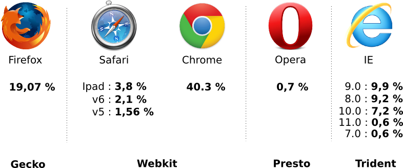
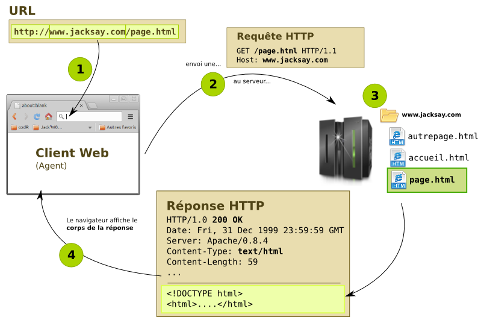
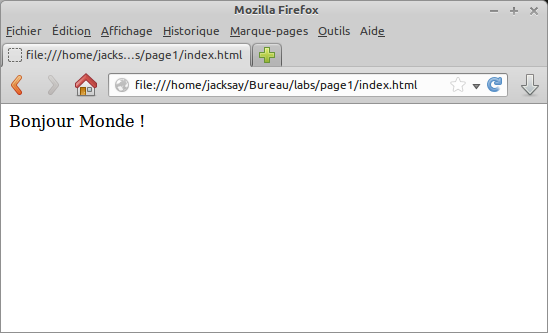
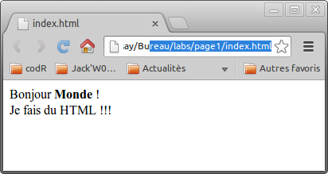
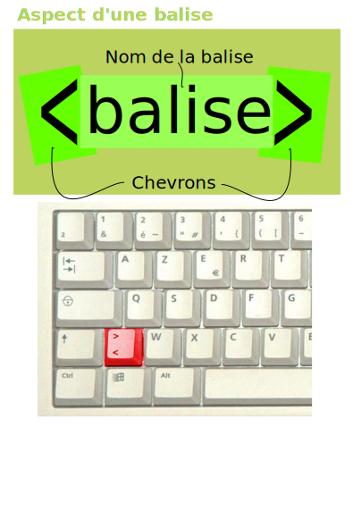
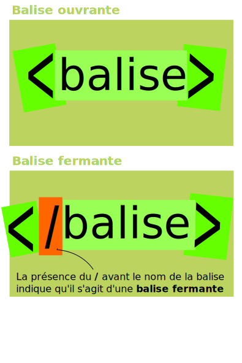
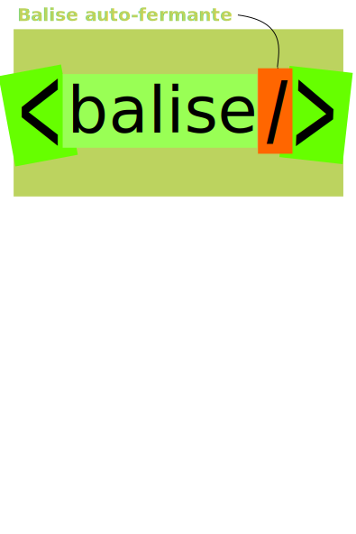
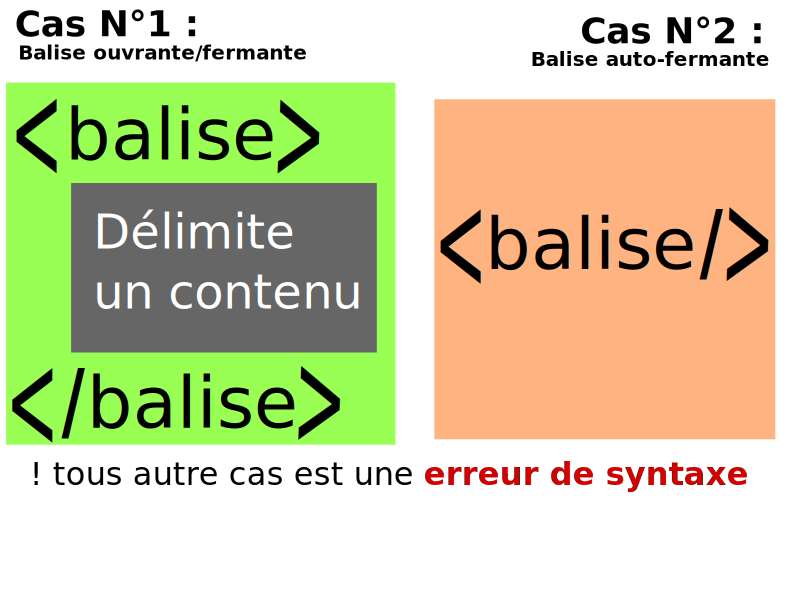
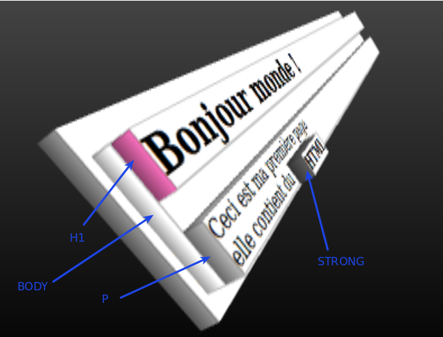

% HTML5
% Stéphane Bouvry
% 2014

# Introduction

## C'est quoi ?

## Un ensemble de technologie

HML5 - CSS3 - Javascript

- Création de document web (page web)
- Applications Web (Web apps)
- Applications desktop (Windows 8, Firefox OS, Chrome OS)
- Application mobile (Hybride)
- Bien plus (TV, console, ...)

## HTML5, un langage

- Langage de description par **balises** ;
- Conçu pour être simple à utiliser
- Un langage sémantique (Structurer l'information)

## 1990, origines {data-background="../images/bg-berners.jpg"}

**Tim Berners** pose les bases du web : 


- 1^er^ navigateur,
- le protocol HTTP,
- et le HTML.

## 1992

1 000 000 ordinateurs connectés

## 1993 Mosaic

Le Web s'étend à la communauté scientifique et se popularise grâce à **NCSA Mosaic**, un navigateur capable d'afficher... des images.


## 1994 Netscape

- **Netscape navigator** popularise le web hors des universités en permettant de réaliser les premiers sites visuels.
- Fondation du **W3C** (World Wide Web Consortium). 
- Création de Facebook

## Evolution 1995

- Guerre des navigateurs
- Apparition d'**Internet Explorer**.
- Spécification de HTML 2.0 est publiée.

## 1996

36 000 000 ordinateurs connectés


## 1997

- **HTML 3.2** Syntètise les améliorations apportées par netscape et Internet explorer
- **HTML 4** sort dans la foulée. 
- Arrivée en force des **style CSS** et des scripts (**Javascript**).

## 2000

368 540 000 ordinateurs connectés

## 2000/2008 Web 2.0

**XHTML** est la version strict de HTML 4.Il scèle une bonne fois pour toute la sacro-sainte séparation du contenu (XHTML) et de la forme (CSS).

## 2013

- **XHTML 2** est abandonné, rejeté par la communauté avant même d'être publié.
- **HTML5** et **CSS3**, encore en brouillon, sont déjà adoptés par les principaux navigateurs (Firefox, Chrome, Internet Explorer).
- C'est l'aire du **Web sémantique.**

## Aujourd'hui {data-background="../images/semantic.svg"}

- HTML5 / CSS3 / Javascript se sont imposés bien au delà des navigateurs

## A retenir

- **HTML** : structure la page web.
- **CSS** : Mise en forme
- **Javascript** : Interactivité


# Le World Wide Web

## Principe
Le Web (à ne pas confondre avec Internet), repose sur 3 choses : 

- Le **navigateur web**,
- Le **protocole HTTP**,
- et le **langage HTML**.

## Navigateur

Le navigateur permet de consulter des documents sur le web, selon le **moteur de rendu**, le résultat peut varier (Surtout sur Internet Explorer < 10)



## protocole HTTP



## Contraintes du web

Quelle sont les contraintes du web ?

- Ergonomie
- Esthétiques
- Structure et architecture des informations
- Marketing et commerciale
- Norme, standard et technique
- Budget


# HTML, le langage


## Fichier HTML

Le code HTML s'écrit dans des fichiers HTML ; Les fichiers HTML sont de simples fichiers texte.

N'importe quel éditeur de texte suffit pour éditer du HTML.

Par convention, on utilise l'extention `*.html` (ou `*.htm` pour les puristes) ;Pour tester une page HTML, il suffit de l'ouvrir dans un navigateur ;

## Editeurs HTML

Pour faire du HTML, il faut un éditeur de texte, pour débuter voici quelques éditeurs très performants : 

- **Sublim Text** : Le plus populaire chez les développeurs web,
- **Notepad++** 
- **Vi**
- **Bracket Bracket**, le petit nouveau, prometteur

## Exemple

Dans un fichier `index.html`, on écrit : 

```html
Bonjour Monde !
```

Dans le navigateur :



---

Le **code source** d'une page web est du simple texte.

Ce code source est **interprété** par le navigateur avant d'être affiché.

---

```html
Bonjour <strong>Monde</strong> !<br/>
Je fais du HTML !!!
```
Donne...



## Question ?

Peut-t'on considérer que nous avons une page web ?

# Syntaxe HTML

## Introduction

<div class="col">
Le **code source** HTML permet de structurer les informations avec des balises. Les balises sont **toujours entourées de chevrons** Un nom de balise est écrit en minuscule et ne contient pas de
caractères accentués, ni espaces.
</div>
<div class="col">

</div>


## Types de balises

On distingues différentes formes de balises : 

- Les balises ouvrantes,
ex: `<h1>`, `<p>`, 
- Les balises fermantes, ex: `</h1>`, `</p>`, 
- Les balises orphelines (ou auto-fermantes)ex: `<br />`, 

## Balises ouvrantes et fermantes

<div class="col">
Les balises **ouvrantes** et **fermantes** permettent de délimiter
du contenu.
C'est le cas le plus répandu.    
```html
<h1>Ce contenu sera un titre</h1>
<p>
    Ce contenu sera un paragraphe, avec
    <strong>
        ce texte en gras
    </strong>
</p>
``` 
</div>
<div class="col">

</div>

## Balises auto-fermantes

<div class="col">
Certaines balises **ne délimitent aucune information**
Plutôt que de les ouvrir et de le refermer ex : `<balise></balise>`
On utilise une syntaxe raccourcie : `<balise/>`

```html
<!-- Liseré horizontal -->
<hr />
Texte avec un<br />
Retour à la ligne
```
</div>
<div class="col">

</div>

## A retenir



## Validation

Vous pouvez tester la validité d'un code HTML en utilisant le [Validateur W3C](http://validator.w3.org/)


# Syntaxe "avancées"

## Règle de base

l'enchaînement de balise est appellé l'**imbrication**

```html
<body>
<h1>Bonjour monde !</h1>
<p>
Ceci est ma première page<br/>
elle contient du 
<strong>HTML</strong> !
</p>
</body>
```

---

Il est souvent représenté sous la forme d'un arbre (on parle de l'arbre DOM).




## Règles d'imbrication


- Par convention, les balises ouvrantes 
**doivent être refermées**

- 
La première balise ouverte est la dernière refermée.


- 
Les balises s'imbriquent, elles ne se croisent pas...

---


Bien...

```html
<body>
    <h1>Bonjour monde !</h1>
    <p>
        Ceci est ma première page<br/>
        elle contient du 
        <strong>HTML</strong> !
    </p>
</body>

```


Pas bien...

```html
<body>
    <h1>Bonjour monde !
    <p>
        Ceci est ma première page</h1>
        elle contient du 
        HTML<strong/> !
</body>
<p>
```

## Commentaires

Un code source HTML est dense.

Les **commentaires** sont très utilisés pour permettre aux
intégrateurs d'annoter le code source.

Un commentaire est entouré par `<!--` et `-->`


```html
<!-- Menu principal -->
<nav>ACCUEIL - SERIES - CONTACT</nav>

<!-- Contenu -->
<section>
    Bla bla
</section>

<!-- Pied de page -->
<footer>
    Copyright &copy; 2014
</footer>

```

Les commentaires sont également très utiles
pour désactiver une partie du code HTML.

## Attributs de balise

Les **attributs** de balise permettent d'indiquer des 
informations au navigateur.

       
Exemple : La balise `img` est utilisée pour afficher 
des image, Seule elle n'a aucun interêt. L'attribut `src` 
indique l'emplacement de l'image : 


```html

```

Les attributes n'apparaissent que dans les
**balises ouvrantes** et les
**balises auto-fermantes**.

## Syntaxe des attributs
La syntaxe des attributs est toujours la même : 


```html
<balise attribut1="Valeur entre guillemets">...</balise>
```


On peut cumuler les attributs en les séparant avec au moins un espace : 

```html

```


On peut également utiliser les retours à la ligne pour gagner en clarté : 

```html

```

# Structure minimale

## Introduction

```html
<!DOCTYPE html>
<html>
    <head>
        <meta charset="utf-8" />
        <title>Titre de la page</title>
    </head>
    <body>
        Corps de la page
    </body>
</html>
```

Les documents HTML sont dit structurés.
On distingues généralement 2 grandes parties : 

- L'entête : à l'attention du navigateur
- Le corps : La partie qu'on voit

## Le prologue

```html
<!DOCTYPE html>
...
```

Le **prologue** : Il explique au navigateur 
qu'il a affaire à du code HTML.


Le prologue **n'est pas une balise**    

## La balise HTML

```html
<!DOCTYPE html>
<html>
 ...
</html>

```

Le prologue est toujours suivit de la balise `<html>`, la 
première balise ouverte, et donc la dernière fermée. (on 
parle de la racine du document)

On peut également utiliser l'attribut lang pour indiquer la langue du document.

```html
<!DOCTYPE html>
<html lang="fr">
 ...
</html>
```

## L'en-tête

```html
<!DOCTYPE html>
<html>
    <head>
        <meta charset="utf-8" />
        <title>Titre de la page</title>
    </head>
    ...
</html>

```

l' **en-tête** est délimité par les balises `<head></head>` : 

Il contient des **métas informations**, 
principalements déstinées aux navigateurs et aux moteurs de recherche.


Vous trouverez en annexe de cette diapo les différentes 
balises rencontrées dans l'en-tête d'un document HTML.

## Le corps

```html
<!DOCTYPE html>
<html>
    <head>
        <meta charset="utf-8" />
        <title>Titre de la page</title>
    </head>
    <body>
        Corps de la page
    </body>
</html>

```

le **corps de la page** est délimité par les balises `<body></body>` : 

Il contient la partie visible de la page.

# Structurer l'information

## Le contenu texte

Pour délimiter des zones de texte, on utilise principalement 2 types de balise : 

- La balise `p` pour les paragraphes ;
- Les balises `h1 h2 h3 h4 h5 h6` pour les titres

. . .

```html
<body>
    <h1>Titre principale</h1>
    <p>Lorem ipsum dolor sit amet, consectetur adipiscing elit. Donec id.</p>

    <h2>Partie 1</h2>
    <h3>Sous partie 1.1</h3>
    <p>Lorem ipsum dolor sit amet, consectetur adipiscing.</p>
</body>
```

## Division `div`

Cette balise n'a pas de sens sémantique, elle est généralement utilisée pour styliser une partie de la page.

```html
<div class="colonneDeGauche">
    MENU
</div>
<div class="colonneDeDroite">
    Contenu de la page
</div>
```

## balise `article`

Délimite un contenu auto-suffisant (pas forcement un article au sens journalistique).
En théorie, le contenu d'une balise `article` doit pouvoir être réutilisé tel quel.

```html
<body>
    <h1>épisodes saison 1</h1>
    <article>
        <h2>Episode 1</h2>
        <p>Résumé...</p>
    </article>
    <article>
        <h2>Épisode 2</h2>
        <p>Texte</p>
    </article>
</body>


```

## balise `section`

La balise `section` permet de regrouper des 
contenus qui ont un thème communs.


```html
<h1>Épisode de Breaking bad</h1>
<section>
    <h2>Saison 1</h2>
    <article>
        <h3>Episode 1</h2>
        <p>Résumé...</p>
    </article>
    <article>
        <h3>Episode 2</h3>
        <p>Résumé...</p>
    </article>
</section>

<section>
    <h2>Saison 2</h2>
    ...
</section>
```

## La balise `header`

Elle délimite un contenu introductif : bandeau du site, titre, 
résumés, métas informations (date de publication, auteur, mots clefs). 

```html
<body>
    <header>
        <h1>Mon premier site web</h1>
        <p>Baseline</p>

        <nav>
            MENU
        </nav>
    </header>
    ...
```

## La balise `footer`

A l'image de `header`, la balise `footer` vient conclure le contenu où il est situé.

```html
<body>
    <header>
        Mon super site
    </header>
    <nav>Menu du site</nav>

    <article>...</article>

    <footer>
        Pied de page
    </footer>
</body>
```

## La balise `nav`

La balise `nav` permet de délimiter un contenu qui va permettre la navigation.

Cette navigation doit être relative à l'emplacement de la balise (Table des matière 
d'un article, sommaire d'une section, menu d'un site, etc...).


```html
<body>
    <header>
        <h1>Mon super site</h1>
    </header>
    <nav>
        <a href="page2.html">Artistes</a>
        <a href="page3.html">Oeuvres</a>
    </nav>
    ...
```

## La balise `aside`

On l'utilise généralement sur le site entier (body) ou un 
article pour délimité une information complémentaire.

```html
<article>
    <h1>Titre</h1>
    <p>HTML et CSS</p>
    <aside>
        <h3>Glossaire</h3>
        <dl>
            <dt>CSS</dt>
            <dd>Cascading Style Sheet</dd>
            <dt>HTML</dt>
            <dd>HyperText Markup Language</dd>
        </dl>
    </aside>
</article>
```

# Mettre en forme

## CSS, Cascading Style Sheet

Les feuilles de style en cascade sont utilisées pour mettre en forme les documents HTML.

---

Il s'agit d'un autre langage que HTML

---

## Syntaxe 

# Annexe


## Les attributs communs

Voici la liste des attributs communs à toutes le balises (et souvent facultatifs) : 


AttributUsage


classPermet d'assigner une ou plusieurs classes CSS à l'éléments


idFixe l'identifiant (unique) de l'élément.


styleDéfinit une "CSS en ligne"


titleDescription complémentaire (affiche une info-bulle)


langPrécise la langue utilisée dans le contenu (si différente de celle du document)


## L'en-tête

Voici les balises généralement présentent dans l'entête : 


Balise
Rôle
Cas d'utilisation


`title`


Titre de la page


Sa présence est obligatoire.


`meta`


Métas informations


    - Charset (encodage)
    - Infos pour les moteurs de recherche (description, mots-clefs, etc...)
    - Clefs pour les outils de référencement
    - Informations de support (mobile)


`link`


Fichiers attachés / en rapport


    - Flux RSS/ATOM
    - Style CSS
    - Icône de favoris/application mobile


`script`


Script


Javascript dans 99% des cas


## Les vieux prologues

Voici les anciens prologues que l'on peut rencontré au lieu du très dépouillé: 

```html
<!DOCTYPE html>

```


### XHTML

XHTML strict (le plus répandu)

```html
<!DOCTYPE html      
        PUBLIC "-//W3C//DTD XHTML 1.0 Strict//EN"     
        "DTD/xhtml1-strict.dtd"
```

XHTML Transitional

```html
<!DOCTYPE html      
        PUBLIC "-//W3C//DTD XHTML 1.0 Transitional//EN"
        "DTD/xhtml1-transitional.dtd">
```


