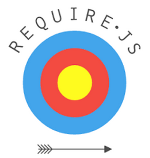

% 
% Javascript Module Loader
% 2016

# Présentation{data-background="../images/illustrations/presentation.jpg"}

## C'est quoi RequireJS ?

**RequireJS** est un *Module Loader* Javascript.

Il permet d'organiser et de charger dynamiquement le code Javascript pour **optimiser** son chargement.

Il évite notamment ce type de code :
```html
<script src="js/jquery/dist/jquery.min.js"></script>
<script src="js/underscore/underscore.min.js"></script>
<script src="js/backbone/backbone.min.js"></script>
<script src="js/handlebars/handlebars.min.js"></script>
<script src="js/bootstrap/dist/js/bootstrap.min.js"></script>
<script src="js/bootbox.js/bootbox.min.js"></script>
<script src="js/moment/moment.min.js"></script>
<script src="js/moment/MonApplication.js"></script>
<script>
var app = new MonApplication();
</script>
```

---

Pour obtenir ça :

```html
<script src="js/requirejs/require.js" data-main="js/main.js"></script>
```

## Principe

On va définir dans un fichier de configuration l'emplacement des fichiers javascript ainsi que leurs dépendances.

Ensuite, les appels du code provoqueront le chargement des fichiers Javascript necessaires.

Si des librairies ne sont pas necessaires immédiatement, elles ne seront pas chargées


## Installation

Les sources sont disponibles sur le site officiel : [RequireJS.org](http://requirejs.org/).

On peut également utiliser des gestionnaires de paquet comme **Bower** ou **NPM**.

```bash
bower install requirejs
```

Ensuite on utilise la balise `script` pour charger le code de **RequireJS** :

```html
<script src="chemin/vers/require.js"></script>
```


## Usage simple : basique

On peut utiliser **RequireJS** en l'état pour ensuite charger ces fichiers Javascript à la demande :

```javascript
// Exemple de chargement de fichier
requirejs(['fichier1.js'], function(){
  console.log('fichier1.js est chargé !');
});
```

Exemple de contenu :

```javascript
// fichier1.js
console.log('Execution du contenu de fichier1.js !');
```


## Usage simple : plusieurs fichiers

La fonction `requirejs` permet de spécifier en premier argument **plusieurs fichiers** à charger :

```javascript
// Exemple de chargement de plusieurs fichiers
requirejs(['fichier1.js', 'fichier2.js'], function(){
  console.log('fichier1 et 2 sont chargés!');
});
```

La *callback* ne sera exécutée que lorsque les 2 fichiers seront chargés, a noter que ce chargement étant asynchrone, on ne peut pas savoir lequel des 2 fichiers sera chargé avant l'autre.

## Pas de .js

La présence de l'extension **.js** est facultative :

```javascript
// Exemple de chargement de plusieurs fichiers
requirejs(['fichier1', 'fichier2'], function(){
  console.log('fichier1 et 2 sont chargés!');
});
```


# Configuration{data-background="../images/illustrations/configuration.jpg"}

## Principe

La configuration permet de préciser à **RequireJS** :

 * L'emplacement des fichiers JS
 * Les modules (alias et emplacement)
 * Les dépendances

```javascript
requirejs.config({
  // Configuration
});
```

## Emplacement avec baseUrl

La propriété **baseUrl** permet de renseigner depuis quel dossier les fichiers javascript sont chargés :

```javascript
requirejs.config({
  baseUrl: "js"
});
```

Maintenant, par défaut, les fichiers chargés le seront depuis le dossier **js/**.


## Déclarer des emplacements avec paths

La propriété **paths** permet de déclarer les alias et l'emplacement des fichiers :

```javascript
requirejs.config({
  baseUrl: "js",
  paths: {
    // ./js/app/script1.js
    script1: "app/script1",

    // ./js/app/script2.js
    script2: "app/script2",

    // ./js/app/script3.js
    script3: "app/script3"
  }
});
```

Ensuite un simple `requirejs(['scriptX'], ...)` permettra de charger le fichier.

## Dépendances avec shim

On peut gérer les dépendances avec la propriété `shim` :

```javascript
requirejs.config({
  baseUrl: "js",
  paths: {
    script1: "app/script1",
    script2: "app/script2",
    script3: "app/script3",
  },
  shim: {
    // script3 a besoin de script1
    script3: {
      deps: ['script1']
    },
    // script 1 a besoin de script2
    script1: {
      deps: ['script2']
    }
  }
});
```

**RequireJS** se chargera d'inclure les dépendances necessaires automatiquement.

## data-main

Dans le cadre d'application *single page*, on peut centraliser avec l'attribut ‘data-main‘ pour charger automatiquement un script une fois RequireJS chargé :

```html
<script src="chemin/vers/require.js" data-main="mon-application.js"></script>
```

## data-main : piège{data-background="../images/illustrations/trap.jpg"}

L'utilisation de `data-main` **est asynchrone**,

si d'autres balises `scripts` avec du code suivent cet appel, il est possbile que le code ne soit pas encore chargé lors de l'exécution.

```html
<script src="chemin/vers/require.js" data-main="mon-application.js"></script>
<script>
// ICI, il est possible que le contenu de data-main ne soit pas encore chargé
</script>
```

Mieux vaut utiliser les dépendances.


# Modules{data-background="../images/illustrations/module.jpg"}

## Principe

Le code javascript est rarement actif explicitement dans un fichier, il est chargé, puis sont code est éxécuté dans le script principal.

Il est donc préférable d'utiliser les modules.

## Déclarer un module (format AMD)

La fonction `define(callback)` prend en paramètre un fonction callback qui devra retourner le module
à charger :

```javascript
// js/app/script1.js
define(function(){
  "use strict";
  // On code son module
  var Script1 = {
    name: "Script1",
    version: "0.0.1",
    direBonjour: function(){
      console.log('Bonjour');
    }
  }

  return Script1;
});
```

## Charger un module

Ensuite, au niveau de l'appel de `requirejs`, le module sera disponible dans la fonction callback :

```javascript
// index.html
requirejs(['script1'], function(Script1){
  console.log("Script1 est disponible !");
  Script1.direBonjour(); // Affiche 'Bonjour'
});
```

## Utiliser une fonction anonyme

Il est également préférable d'encapluser la déclaration du module dans une fonction anonyme pour le rendre fonctionnel sans l'utilisation de **RequireJS** :

```javascript
(function(root){
  "use strict";
  // On code son module
  var Script1 = {
    name: "Script1",
    version: "0.0.1",
    direBonjour: function(){
      console.log('Bonjour');
    }
  }
  if( root.define ){
    define(function(){
      return Script1;
    });
  } else {
    root.Script1 = Script1;
  }
})(this);
```

# Examples

## Le module TEXT

Le module text <https://github.com/requirejs/text> de requirejs permet de charger des fichiers texte, par exemple pour gérer les templates externalisés :

```javascript
requirejs.config({
  // ...
  paths: {
    // Emplacement du module
    'text': 'path/to/requirejs-text/text'
  }
});
```

puis :

```javascript
requirejs(['text!monfichier.txt'], function(contenuDuFichier){
  console.log('le fichier monfichier.txt contient : ' + contenuDuFichier);
})
```

## Le module JSON

Le module text <https://github.com/requirejs/json> de requirejs permet de charger des fichiers JSON :

```javascript
requirejs.config({
  // ...
  paths: {
    // Emplacement du module
    'json': 'path/to/requirejs-json/json'
  }
});
```

puis :

```javascript
requirejs(['json!monfichier.json'], function(json){
  console.log('Données JSON : ' + json);
})
```


## JQuery/Bootstrap/Bootbox

Configuration et usage

```javascript
// js/app.js
requirejs.config({
   baseUrl: 'js',
   paths: {
      "jquery": "jquery/dist/jquery",
      "bootstrap": "bootstrap/dist/js/bootstrap",
      "bootbox": "bootbox.js/bootbox"
   },
   shim: {
      bootstrap: { deps: ["jquery"] },
      bootbox: { deps: ["bootstrap"] }
   }
});

require(['jquery'], function(){
   $('#example').on('click', function(){
      // Bootbox et bootstrap ne seront chargés que au click
      require(['bootbox'], function(bootbox){
         bootbox.alert("Démonstration !");
      });
   });
});
```
