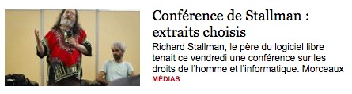
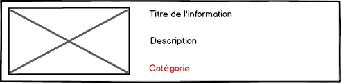
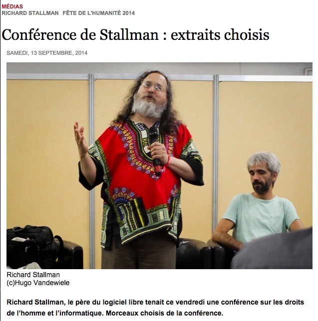
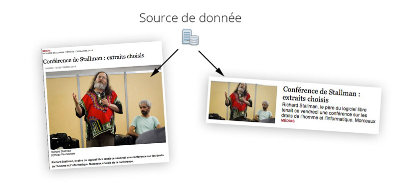
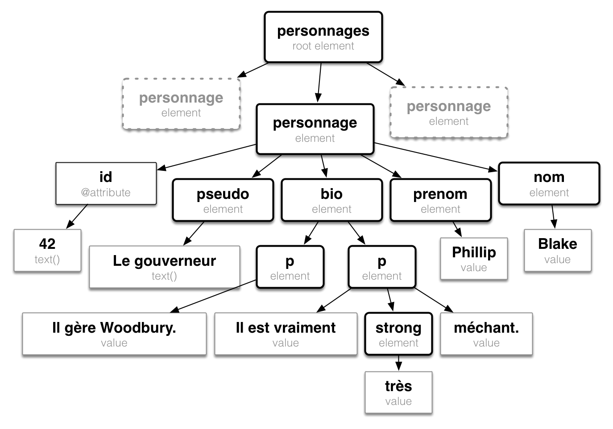

% Technologies XML
% Stéphane Bouvry <jacksay.com>
% Caen, 2014


# XML {data-background="../images/bg-xml.jpg"}
eXtensible Markup Language


---

## C'est quoi XML ?

- un langage de balise
- un **méta langage**
- une norme

---

### A quoi ça sert ?

- A modéliser des structures d'informations logiques
- utilisé pour **l'interopérabilité** des sytèmes d'information
- Créer d'autres langages (SVG, RSS, HTML, etc...)


----

### XML : Structure logique

Dans un document, on distingue :

- La structure visuelle
- La structure sémantique

---

### Structure visuelle

(Manière de présenter l'information)


---

La structure visuelle est la même d'un document à l'autre





---

Une même information peut être présentée <br/> de différentes façons...

---



---



---

### Structure logique

La structure logique organise les informations, exemple : 

- titre
- chapo
- contenu
- date de publication
- auteur
- catégorie
- etc...

---

Représentation d'une news avec XML

```xml
<article identifiant="42">
	<titre>Conférence de Stallman...</titre>
	<chapeau>Richard Stallman, le père du logiciel libre...</chapeau>
	<date>13 semptembre 2014</date>
	<illustration>../images/news-42.jpg</illustration>
	<categorie>Médias</categorie>
	<auteur>Jean-Claude</auteur>
</article>
```

Cool, XML est en français... en fait non

---


### XML is What You Want

XML permet de définir la **structure que l'on veut**. 

(Pas de balise prédéfinies)

Mais il faut respecter le **formalisme XML**


# Formalisme XML
Règles de syntaxe XML

---

Même si XML vous permet de structurer les informations selon vos besoin, il document **doit être bien formé**

---

## Les éléments :

Un document XML est composé d'éléments : 

```{.xml}
<element>
	Contenu de l'élément
</element>
```

Les éléments sont entourés de chevrons `<nom>`

Au minimum, un document contiendra un élément, on parle de l'**élément racine**

---

Le nom de l'élément et (presque) libre, il peut contenir : 

 - des minuscules / majuscules
 - des chiffres
 - des tirets _
 - des traits d'union -
 - des points .

---

# {data-background="#ffb400"}


Attention dans le choix du nom : 

- Il ne doit pas commencer par un chiffre,
- Il est  *sensitive case*
- Il ne peut pas commencé par `xml`

---

*A minima, un document contient un **élément racine***

---

Un élément peut contenir du texte : 

```xml
<personnage>
	Walter White
</personnage>
```

---

Ou d'autres éléments : 

```xml
<personnage>
	<nom>White</nom>
	<prenom>Walter</prenom>
	<surnom>Heisenberg</surnom>
</personnage>
```

---

Ou un mixte des deux : 

```xml
<citation>
	Je ne suis pas en danger 
	<personne>Skyler</personne>, <sautDeLigne/>
	<emphase>Je suis le danger</emphase>
</citation>
```

---

Les éléments qui ne contient ni texte ni élément ont une syntaxe particulière : 

```xml
<elementVide />
```
. . .

Il aura généralement des attributs

```xml
<identifiant valeur="42" />
```

. . .

On parle d'élément vide ou d'élément orphelin.

---

### Les attributs

Les attributs permettent d'enrichir les informations relatives à un élément.

```xml
<personnage age="50" taille="184">
	<nom>White</nom>
	<prenom>Walter</prenom>
	<surnom>Heisenberg</surnom>
</personnage>
```

---

Il y'a quelques régles pour les attributs :

- Mêmes règles de nommage que pour les noms d'éléments.
- Un élément peut contenir autant d'attributs que l'on veut.
- Seul les éléments ouvrants et les éléments vides ont des attributs.
- Les valeurs d'attributs sont toujours entre guillemets double, même vide `<tag attribut="">`{.xml}.


---

### Commentaire

Un document XML peut être commenté

```xml
<film>
	<!-- Ceci est un commentaire -->
	<titre>Iron Man</titre>
</film>
```

---

### Caractères réservés : 

Certains caractères doivent être substitués pour être affichés en tant que texte :

- **<** devient `&lt;`{.xml}
- **>** devient `&gt;`{.xml}
- **&** devient `&amp;`{.xml}
- **"** devient `&quot;`{.xml}

---

### Entités persos

Les DTD permettent de définir des entités, elles seront présentes dans le texte XML sous la forme `&entite;`{.xml}


---

### Sections littérales : 

Elles permettent de délimiter une zone de contenu libre : 

```xml
<content><![CDATA[
	<h2>Exemple</h2>
	<p>Ici on utilise les caractères que l'on veut
	chevrons > ou < ou même & sans problèmes.
	C'est courant pour des éléments avec beaucoup 
	de contenu...</p>]]>
</content>
```

---

# L'arbre XML

---

## Le code XML

```xml
<?xml version="1.0" encoding="utf-8"?>
<personnages>
	<personnage id="42">
		<pseudo>Le gouverneur</pseudo>
		<prenom>Phillip</prenom>
		<nom>Blake</nom>
		<bio>
			<p>
				Il gère Woodbury
			</p>
			<p>
				Il est vraiment 
				<strong>très</strong>
				méchant
			</p>
		</bio>
	</personnage>
</personnages>
```

---




---

# Structure du document

---

## prologue

C'est la première ligne du document (obligatoire) : 

```xml
<?xml version="1.0" encoding="UTF-8" ?>
<elementRacine>
	Demo
</elementRacine>
```

Elle précise également l'encodage utilisé et la version de XML.

---

### La DTD

Le prologue peut être suivi d'une référence à la DTD : 

```xml
<?xml version="1.0" encoding="UTF-8" ?>
<!DOCTYPE articles SYSTEM "articles-definition.dtd">
<elementRacine>
	Demo
</elementRacine>
```

---

### Instruction de traitement

Plus rare, le prologue peut également contenir des informations de traitement :

```xml
<?xml version="1.0" encoding="UTF-8" ?>
<?xml-stylesheet href="fichier.css"?>
<elementRacine>
	Demo
</elementRacine>
```

---

### Conformité du document

On peut vérifier la conformité d'un document : 

- En l'ouvrant dans le navigateur,
- En utilisant des outils dédiés : 
	`xmllint --noout fichier.xml` <http://xmlsoft.org/xmllint.html>

---

### Références

Cours XML sur openclassroom <http://fr.openclassrooms.com/informatique/cours/structurez-vos-donnees-avec-xml/qu-est-ce-que-le-xml>

Cours de Gilles Chegnon <http://www.gchagnon.fr/cours/xml/base.html>

--- 


<div style="font-size: .8em; text-align: justify">Une bouteille d’eau Cristaline de 150cl contient par litre 71mg d’ions positifs calcium, et 5,5mg d’ions positifs magnésium. On y trouve également des ions négatifs comme des chlorures à 20mg par litre et des nitrates avec 1mg par litre. Elle est recueillie à St-Cyr la Source, dans le département du Loiret. Son code barre est 3274080005003 et son pH est de 7,45. Comme la bouteille est sale, quelques autres matériaux comme du fer s’y trouvent en suspension.

Une seconde bouteille d’eau Cristaline a été, elle, recueillie à la source d’Aurèle dans les Alpes Maritimes. La concentration en ions calcium est de 98mg/l, et en ions magnésium de 4mg/l. Il y a 3,6mg/l d’ions chlorure et 2mg/l de nitrates, pour un pH de 7,4. Le code barre de cette bouteille de 50cl est 3268840001008. Une bouteille de même contenance est de marque

Volvic, et a été puisée à... Volvic, bien connu pour ses sources donnant un pH neutre de 7. Elle comprend 11,5mg/l d’ions calcium, 8,0mg/l d’ions magnésium, 13,5mg/l d’ions chlorures et 6,3mg/l d’ions nitrates. Elle contient également des particules de silice. Son code barre est 3057640117008.

PS : Volvic est dans le Puy-de-Dôme</p>
