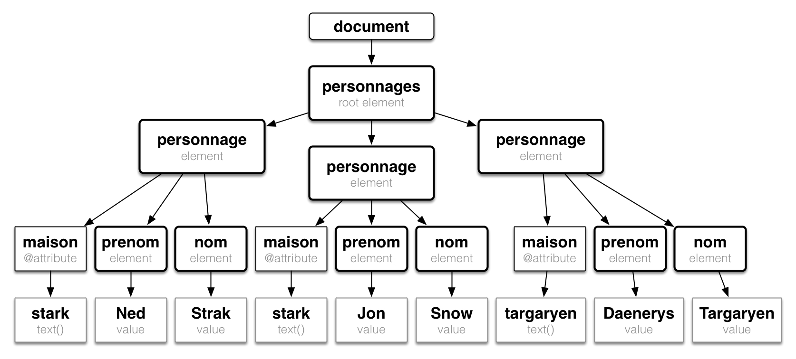
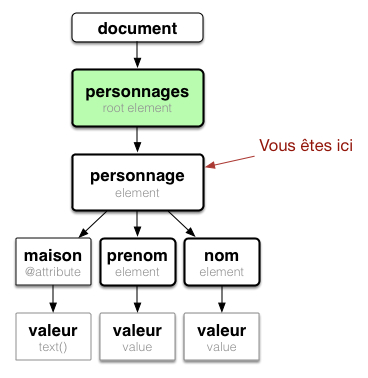
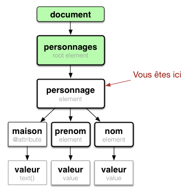
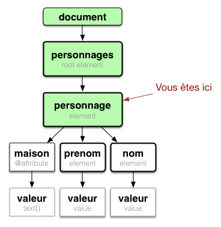
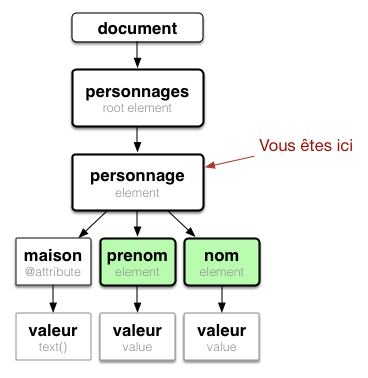
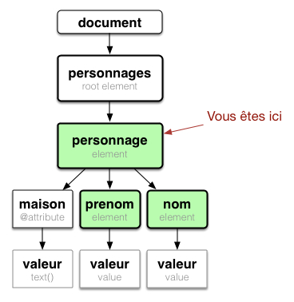
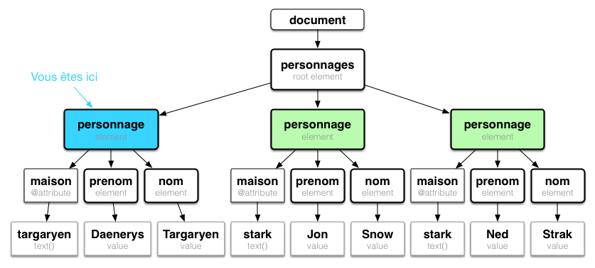
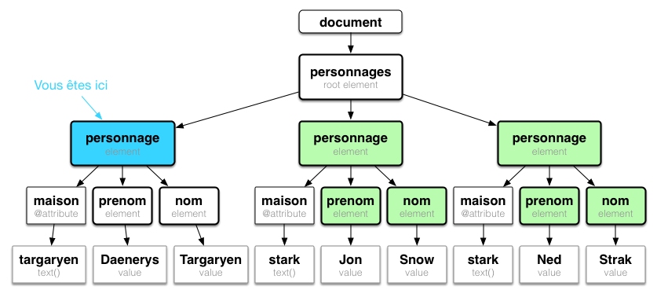
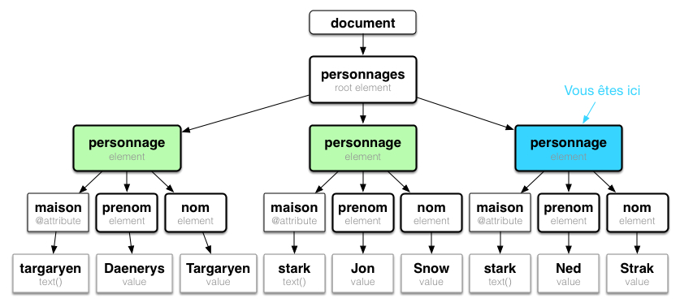
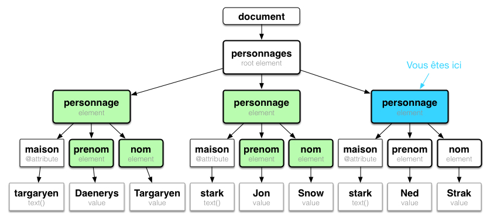

% Technologies XML
% Stéphane Bouvry
% Caen, 2014

# XPath {data-background="./../images/bg-dtd.jpg"}
Requêtes XML


---

## Présentation

XPath est un langage permettant d’exprimer des requêtes afin de localiser des parties d’un document XML.

- Il est utilisé par XSLT et XQuery
- XPath se base sur la structure arborescente d’un document XML.

---

## Résultat de requête

Une requête XPath 1.0 produit en résultat : 

- un ensemble de nœuds (**NodeSet**), 
- un nombre décimal, 
- une chaîne de caractères 
- un booléen.

---

## Le XML

```xml
<?xml version="1.0" encoding="utf-8" ?>
<personnages>
	<personnage maison="stark">
		<nom>Ned</nom>
		<prenom>Stark</prenom>
	</personnage>
	<personnage maison="stark">
		<nom>Snow</nom>
		<prenom>jon</prenom>
	</personnage>
	<personnage maison="targaryen">
		<nom>Daenerys</nom>
		<prenom>Targaryen</prenom>
	</personnage>
</personnages>
```

---



---

## Requête

Une requête (ou *ou chemin de localisation*) XPath permet de parcourir un arbre XML sous la forme : 

`direction::selecteur[predicat]`

---

## Directions (ou axes)

---



`parent::* = {<personnages>}`


---



`ancestor::* = {<personnages>, </>}`

---



`ancestor-or-self::* = {<personnage>, <personnages>, </>}`

---

### Autres directions



`child::* = {<prenom>, <nom>}`

---


`descendant::* = {<prenom>, <nom>}`

---



`descendant-or-self::* = {<personne>, <prenom>, <nom>}`

---

### Autres directions (suite)

---



`preceding-sibling::*`

---



`preceding::*`

---



`following-sibling::*`

---



`following::*`

---

## Sélection

---

### Attribut

Pour sélectionner un attribut, on utilise `attribute::<attr>`

- `attribute::*` : Tous les attibuts
- `attribute::maison` : l'attribut *maison*

---

### Nœud courant

Pour faire référence au noeud courant on peut utiliser `self::node()`

---

### Élément

On utilise le nom de l'élément sous la forme : 
`axe::noeud`

---

## Chemin absolu

S'exprime par rapport à la racine sous la forme : 

`/noeud1/noeud2/.../noeudCible`

exemple, Sélectionne tous les noeuds *nom* :
```xpath 
/child::personnages/child::personne/child::nom
```

---

## Chemin relatif

S'exprime par rapport au noeud courant : 
`noeud/noeud/.../cible`

exemple (depuis personnes), sélectionner le nom
```xpath
child::personne/child::nom
```

---

## Chemin abrégé
C'est l'usage courant.

---

### child implicite

Les chemins XPath sont souvent écrit en forme abrégée, l'axe `child::` est implicite. donc 

```xpath 
/child::personnages/child::personne/child::nom
```

peut être écrit : 

```xpath 
/personnages/personne/nom
```

---

### Chemin abrégé

- `/` racine
- `//foo` : tous les noeuds *foo*, <br/> remplace `descendant::foo`
- `.` : Noeud courant, <br/> remplace `self::node()`
- `..` : Noeud parent, <br/> remplace `parent::`
- `@` : Attributs <br/>remplace `attribute::`

---

## Prédicats

Les prédicats permettent d'appliquer des filtres sur la sélection.

---

## Attributs et éléments

Filtre sur la présence d'élément ou attribut : 


Les éléments `personnage` ayant un enfant `surnom`
```
//personnage[surnom]
```

Les éléments `personnage` ayant un attribut `mort`
```
//personnage[@mort]
```

---

### Généralité

Les prédicats utilisent également des **opérateurs** pour filtrer les résultats : 

- Algébrique : `+`, `-`, `*`, `div`, `mod`
- Comparatif : `=`, `!=`, `<`, `<=`, `>`, `>=`
- Booléen : `or`, `and`

---

### exemples

Les personnages portant le nom 'Stark'
```
//personnage[nom = "Stark"]
```

Les éléments `personnage` ayant un attribut `maison` valant "lanister" et ayant un `surnom`
```
 //personnage[@maison = "lanister" and surnom]
```


---

### Position

C'est le prédicat le plus utilisé, il permet de filtrer sur la position du nœud dans un NodeSet. **Attention**, la numération de la position commence à 1 : 

```
/personnages/personnage[position() = 2]
```

`position() = ?` dispose d'une forme abrégée : 

```
/personnages/personnage[2]
```

---

### Autres fonctions

- `text()` : Retourne le texte
- `count(<nodes>)` : nombre de noeud
- `concat(string1, ..., stringN)` : Concaténation
- `contains(where, search)` vrai si `where` contiens `search`
- `not(expression)` vrai si `expression` est faux
- `substring(chaîne,début[,len])` Sous-chaîne 
- Et bien d'autres : <http://jean-luc.massat.perso.luminy.univ-amu.fr/ens/xml/4-xpath.html#idhtex-h2-5>

---

# Exercice

--- 

```xml
<?xml version="1.0"?>
<projet basedir="." default="compile" name="Mon  projet">
	<description> Ceci est un exemple valide de fichier ant</description>
	<property name="options" value="-v" />
	<path id="monClasspath">
		<pathelement localisation="lib/xerces.jar"/>
		<pathelement localisation="lib/xalan.jar"/>
	</path>

	<target name="compile" depends="clean">
		<javac srcdir="." encoding="ISO-8859-1">
			<classpath refid="monClasspath"/>
		</javac>
		<rmic base="." classename="fr.unicaen.test.ServiceImpl">
			<classpath refid="monClasspath">
		</rmic>
	</target>

	<target name="documentation">
		<ant antfile="builtxml" target="pdf" dir="doc/manuel"/>
		<ant antfile="builtxml" target="javahelp" dir="doc/manuel"/>
	</target>

	<target name="clean">
		<delete>
			<fileset dir="." includes="**/*.class"/>
			<fileset dir="." includes="*/*.java" defaul="no"/>
		</delete>
	</target>
</project>
```

---

L’ensemble des nœuds target qui dépendent du but dont le nom est “clean”

- Le noeud target par défault (son nom est égal à l’attribut default du noeud project)
- La valeur de la propriété “options” :
- Les tâches javac qui contiennent au moins deux classpath :
- Toutes les tâches à effectuer pour le but “compile” :
- Le deuxième pathelement de chaque path :