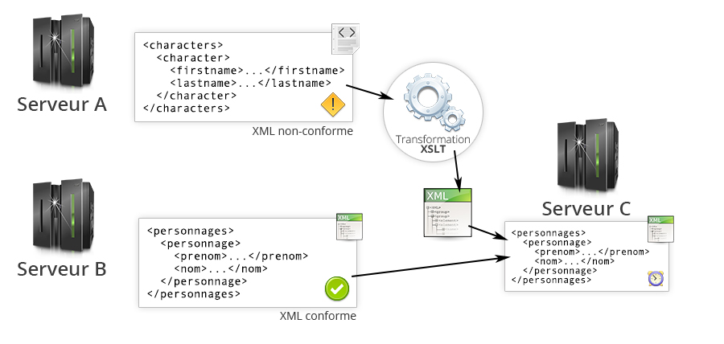

% Technologies XML
% Stéphane Bouvry
% Caen, 2014

# XSLT {data-background="./../images/bg-dtd.jpg"}
Extensible Stylesheet Language Transformations


---

# Présentation

---

## C'est quoi ?

Un langage :

- basé sur XML
- qui utilise XPath pour parcourir une source XML
- et la transformer vers une autre format

---

## Usage



---


---

## Transformation

Pour faire une **transformation XSLT** il faut : 

- Un fichier XML source (à transformer)
- Un fichier XSLT (décrit la transformation)
- Un processeur XSLT (assure la transformation)

---

## Le processeur

Le processeur est un programme qui va charger le XML et le XSLT et produire en sortie le résultat : 

- PHP (natif)
- Java (Apache Xalan, Saxon)
- .NET
- C++
- ligne de commande (xsltproc, xalan)

---

### Sortie

XSLT permet nativement de produire les formats suivant : 

- texte
- XML
- HTML/XHTML

---

### Exemple

```xslt
<?xml version="1.0" encoding="utf-8" ?>
<xsl:stylesheet xmlns:xsl="http://www.w3.org/1999/XSL/Transform" 
		version="1.0">
	<xsl:output method="html"/>
	<xsl:template match="/">
		<h2>Hello World</h2>
	</xsl:template>
</xsl:stylesheet>
```
Résultat :
```html
<h2>Hello World</h2>
```

Dans cet exemple, le contenu du XML source n'aura pas d'impact sur le résultat...

---

## Fichier de base

```xslt
<?xml version="1.0" encoding="utf-8" ?>
<xsl:stylesheet xmlns:xsl="http://www.w3.org/1999/XSL/Transform" 
		version="1.0">
	<xsl:output method="html"/>
	<!-- Règles ICI -->
</xsl:stylesheet>
```

Le contenu est dans la racine `<xsl:stylesheet>...</xsl:stylesheet>`

---

## Namespace

On utilise traditionnellement le *namespace* `xsl`

```
xmlns:xsl="http://www.w3.org/1999/XSL/Transform"
```

---

## Format de sortie

Le format de sortie est précisé via l'élément `<xsl:output method="FORMAT" />` :

- html
- text
- xml

---

## Règles

Le fichier contient une (ou plusieurs) règles déclarées avec `<xsl:template></xsl:template>`

```xslt
<xsl:template match="/">
	<h2>Hello World</h2>
</xsl:template>
```

L'attribut `match` permet de spécifier sur quel élément s'applique le template : 

```xslt
<!-- Affiche 'Hello World' pour chaque élément personnage -->
<xsl:template match="//personnage">
	<h2>Hello World</h2>
</xsl:template>
```

--- 

### Transformation par processeur...

En Ligne de commande

```
xsltproc <FICHIER XSLT> <SOURCE XML>
```

ou

```
java -jar libs/xalan.jar
	-IN <SOURCE XML> 
	-XSL <FICHIER XSLT> 
	[-OUT <SORTIE>]
```

D'autre processeur existent, voir leurs documentations respective.

---

### Avec PHP


```php
<?php
// Chargement du fichier XSLT
$xslDoc = new DOMDocument();
$xslDoc->load("stylesheet.xsl");

// Source XML
$xmlDoc = new DOMDocument();
$xmlDoc->load("fichier.xml");

// Processeur PHP
$proc = new XSLTProcessor();
$proc->xslDoc($xslDoc);

// Transformation
echo $proc->transformToXML($xmlDoc);
```

---

### ...par instuction de traitement

On ajoute une instruction de traitement directement dans le XML : 

```xml
<?xml version="1.0" encoding="utf-8" ?>
<?xml-stylesheet href="style1.xsl" type="text/xsl" ?>
<root>
	<!-- contenu -->
</root>
```

--- 

# XSLT

---

## xsl:output

Attributs :

- format : html, xml, text
- encoding : Encodage
- indent : Applique l'indentation ou pas (yes/no)
- omit-xml-declaration
- doctype-public
- doctype-system

--- 

### Exemple : XHTML

Sortie XHTML : 

```xslt
<xsl:output 
    encoding="utf8" 
    method="xml" 
    doctype-public="-//W3C//DTD XHTML 1.0 Strict//EN" 
    doctype-system="http://www.w3.org/TR/xhtml1/DTD/xhtml1-strict.dtd"
    />
```

Donnera : 

```html
<?xml version="1.0" encoding="UTF-8"?>
<!DOCTYPE html PUBLIC 
	"-//W3C//DTD XHTML 1.0 Strict//EN" 
	"http://www.w3.org/TR/xhtml1/DTD/xhtml1-strict.dtd">
<html>
<head>
	<title>...</title>
</head>
<body>
	TODO
</body>
</html>
```

---

### Exemple : HTML5

```xslt
<xsl:output method="xml" omit-xml-declaration="yes"/>
<xsl:template match="/">
	<xsl:text disable-output-escaping='yes'>&lt;!DOCTYPE html&gt;</xsl:text>
	<html>
		<head>
			<meta charset="utf-8" />
			<title>...</title>
		</head>
		<body>
			TODO
		</body>
	</html>
</xsl:template>
```

Donnera : 

```html
<!DOCTYPE html>
<html>
<head>
	<meta charset="utf-8"/>
	<title>Personnages de game of thrones</title>
</head>
<body>
	TODO
</body>
</html>
```

---

## xsl:template

Un fichier XSLT contiendra des règles `template` qui s'appliqueront au noeud courant (le document), l'attribut `match` contiendra un chemin XPath

```xslt
<?xml version="1.0" encoding="utf-8" ?>
<xsl:stylesheet xmlns:xsl="http://www.w3.org/1999/XSL/Transform" 
		version="1.0">
	<xsl:output method="html"/>
	<xsl:template match="/">
		<h1>Personnages</h1>
	</xsl:template>
</xsl:stylesheet>
```

---

## Instructions clefs

On peut ensuite enrichir la transformation, les instructions les plus utilisées sont : 

- `xsl:for-each`
- `xsl:apply-templates`

---


### xsl:for-each

C'est une boucle classique

```xslt
<?xml version="1.0" encoding="utf-8" ?>
<xsl:stylesheet xmlns:xsl="http://www.w3.org/1999/XSL/Transform" 
		version="1.0">
	<xsl:output method="html" indent="yes"/>
	<xsl:template match="/">
		<h1>Personnages</h1>
		<xsl:for-each select="personnages/personnage">
			<article>
				<h2>
					<xsl:value-of select="prenom" />
					<xsl:text> </xsl:text> 
					<xsl:value-of select="nom" /> 
				</h2>
			</article>
		</xsl:for-each>
	</xsl:template>
</xsl:stylesheet>
```

---

### xsl:apply-templates

```xslt
<?xml version="1.0" encoding="utf-8" ?>
<xsl:stylesheet xmlns:xsl="http://www.w3.org/1999/XSL/Transform" 
		version="1.0">
	<xsl:output method="html" indent="yes"/>

	<xsl:template match="/">
		<h1>Personnages</h1>
		<xsl:apply-templates select="personnages/personnage" />
	</xsl:template>

	<xsl:template match="personnage">
		<article>
			<h2>
				<xsl:value-of select="prenom" />
				<xsl:text> </xsl:text> 
				<xsl:value-of select="nom" /> 
			</h2>
		</article>
	</xsl:template>
</xsl:stylesheet>
```

Si l'attribut `select` est omis, l'application se fait sur `child::*`

---

```xslt
<?xml version="1.0" encoding="utf-8" ?>
<xsl:stylesheet xmlns:xsl="http://www.w3.org/1999/XSL/Transform" 
		version="1.0">
	<xsl:output method="html" indent="yes"/>
	
	<xsl:template match="/">
		<h1>Personnages</h1>
		<xsl:apply-templates />
	</xsl:template>

	<xsl:template match="personnages">
		<xsl:apply-templates />
	</xsl:template>

	<xsl:template match="personnage">
		<article>
			<h2>
				<xsl:value-of select="prenom" />
				<xsl:text> </xsl:text> 
				<xsl:value-of select="nom" /> 
			</h2>
		</article>
	</xsl:template>
</xsl:stylesheet>
```

---

On peut utiliser `xsl:for-each` et `apply-templates` : 
```xslt
<?xml version="1.0" encoding="utf-8" ?>
<xsl:stylesheet xmlns:xsl="http://www.w3.org/1999/XSL/Transform" 
		version="1.0">
	<xsl:output method="html" indent="yes"/>

	<xsl:template match="/">
		<h1>Personnages</h1>
		<xsl:for-each select="personnages/personnage">
			<xsl:apply-templates select="." />
		</xsl:for-each>
	</xsl:template>

	<xsl:template match="personnage">
		<article>
			<h2>
				<xsl:value-of select="prenom" />
				<xsl:text> </xsl:text> 
				<xsl:value-of select="nom" /> 
			</h2>
		</article>
	</xsl:template>
</xsl:stylesheet>
```

--- 

## xsl:value-of

Cette instruction permet de produire du texte à partir d'un chemin XPath : 

```xslt
<article>
	<h2>
		<span class="titre">
			<xsl:value-of select="@titre" /> 
		</span>
		<xsl:value-of select="prenom" />
		<xsl:text> </xsl:text> 
		<xsl:value-of select="nom" /> 
	</h2>
</article>
```


---

# Autres instructions

--- 

**Dans les boucles**

`xsl:sort` Permet de faire des tries


**Conditions**

`xsl:if` Condition simple

`xsl:choose` Switch/case


**Variables**

`xsl:variable` : Déclaration de variable

`xsl:call-template` : Appel un template nommé

`xsl:param` : Paramètres de templates

---

## xsl:sort

Permet de faire un trie : 

- `select` : XPath du critère de trie
- `data-type` : Type de données (`text*`, `number`)
- `order` : ordre du tri (`ascending*` ou `descending`)
- `case-order` : priorité pour les majuscules ou minuscules (`upper-first` ou `lower-first`)

---

## xsl:sort exemple avec xsl:for-each

```xslt
<xsl:template match="/">
	<h1>Personnages</h1>
	<xsl:for-each select="personnages/personnage">
		<xsl:sort select="nom" />
		<xsl:sort select="prenom" />
		<xsl:apply-templates select="." />
	</xsl:for-each>
</xsl:template>

<xsl:template match="personnage">
	<article>
		<h2>
			<xsl:value-of select="prenom" />
			<xsl:text> </xsl:text> 
			<xsl:value-of select="nom" /> 
		</h2>
	</article>
</xsl:template>
```

---

## xsl:sort exemple avec xsl:apply-templates

```xslt
<xsl:template match="/">
	<h1>Personnages</h1>
	<xsl:apply-templates select="personnages/personnage">
		<xsl:sort select="nom" />
		<xsl:sort select="prenom" />
	</xsl:apply-templates>
</xsl:template>

<xsl:template match="personnage">
	<article>
		<h2>
			<xsl:value-of select="prenom" />
			<xsl:text> </xsl:text> 
			<xsl:value-of select="nom" /> 
		</h2>
	</article>
</xsl:template>
```

--- 

## xsl:number : Afficher des nombres

Permet de formatter l'affichage des nombres : 

```xslt
<xsl:number format="(01)." value="9" />
<!-- Affiche (09). -->

<xsl:number format="i" value="9" />
<!-- Affiche ix -->
```

pour un affichage plus complexe (décimal), on utilisera la fonction `format-number()` : 

```xslt
<xsl:value-of select='format-number("1999.9", "###,###.00")' />
<!-- Affiche 1,999.90 -->
```

--- 

## xsl:number, incrément

On peut également utiliser `xsl:number` pour faire un compteur : 

```xslt
<xsl:template match="/">
	<h1>Personnages</h1>
	<xsl:apply-templates select="personnages/personnage" />
</xsl:template>

<xsl:template match="personnage">
	<article>
		<h2>
			<xsl:number level="single" format="001. " />
			<!-- Affichera 001, 002, etc... -->
			<xsl:value-of select="prenom" />
			<xsl:text> </xsl:text> 
			<xsl:value-of select="nom" /> 
		</h2>
	</article>
</xsl:template>
```

Par défaut, l'attribut `value` sera remplacé par `position()`.

---

## xsl:if

Permet de faire une *condition simple* (pas de else) : 

```xslt
<xsl:template match="personnage">
	<article>
		<h2>
			<xsl:value-of select="prenom" />
			<xsl:text> </xsl:text> 
			<xsl:value-of select="nom" /> 
			<xsl:if test="@mort">[MORT]</xsl:if>
		</h2>
	</article>
</xsl:template>
```

---

## xsl:if, autre exemple

```xslt
<xsl:template match="personnage">
	<article>
		<h2>
			<xsl:if test="prenom='Joffrey' and nom='Baratheon'">
				très vilain ! 
			</xsl:if>
			<xsl:value-of select="prenom" />
			<xsl:text> </xsl:text> 
			<xsl:value-of select="nom" /> 
		</h2>
	</article>
</xsl:template>
```

---

## xsl:choose

Permet de faire un test type *switch/case/default* : 

```xslt
<xsl:template match="personnage">
	<article>
		<h2>
			<xsl:value-of select="prenom" />
			<xsl:text> </xsl:text> 
			<xsl:value-of select="nom" /> 
			<xsl:choose>
				<xsl:when test="@maison='stark'">
					Du Nord
				</xsl:when>
				<xsl:when test="@maison='lanister'">
					De Castral Rock
				</xsl:when>
				<xsl:otherwise>
					D'autre part...
				</xsl:otherwise>
			</xsl:choose>
		</h2>
	</article>
</xsl:template>
```

---

## xsl:variable

Les variables sont utilisées pour stoquer des valeurs intermédiaires : 

```xslt
<xsl:template match="personnage">
	<!-- création de la variable 'nomComplet' -->
	<xsl:variable name="nomComplet" select="concat(prenom, ' ', nom)" />

	<article>
		<h2>
			<xsl:value-of select="$nomComplet" />
			<xsl:if test="$nomComplet='Joffrey Baratheon'">
				et sadique...
			</xsl:if>
		</h2>
	</article>
</xsl:template>
```

 **Attention** La variable ne peut pas être modifiée... Ne produit pas d'erreur.

 ---

## xsl:call-template

On peut créer des templates génériques pour les appliquer à des noeuds différents. Les templates génériques ont un attributs `name` : 

```xslt
<!-- template générique -->
<xsl:template name="header">
	<header>
		<h2>
			<xsl:value-of select="concat(prenom, ' ', nom)" />
		</h2>
	</header>
</xsl:template>

<xsl:template match="personnage">
	<article>
		<!-- Appel du template sur le noeud courant -->
		<xsl:call-template name="header" />
	</article>
</xsl:template>
```

Dans ce cas, on utilisera l'instruction `xsl:call-template`

---

## xsl:param

L'interet des templates génériques est l'utilisation des paramètres : 

```xslt
<xsl:template name="header">
	<xsl:param name="nomComplet" select="'Inconnu'" />
	<header>
		<h2>
			<xsl:value-of select="$nomComplet" />
		</h2>
	</header>
</xsl:template>
```

L'attribut `select` permet de selectionner la valeur dans un XPath ou d'indiquer (comme ici) une valeur par défaut.

---

## xsl:with-param

Les valeurs des paramètres sont transmis avec l'instruction `xsl:with-param` : 

```xslt
<xsl:template match="personnage">
	<article>
		<xsl:call-template name="header">
			<xsl:with-param name="nomComplet" select="concat(prenom, ' ', nom)" />
		</xsl:call-template>
	</article>
</xsl:template>
```

---

# Création de noeuds "avancés"

---

Le code suivant **ne fonctionne pas**

```xslt
<xsl:template match="personnage">
	<article class="@maison">
		<header>
			<h2>
			<xsl:value-of select="concat(prenom, ' ', nom)" />
			</h2>
		</header>
	</article>
</xsl:template>
```

Nous voulons copier la valeur de l'attribut maison dans la source pour l'ajouter comme valeur de l'attribut `class`.

---

## xsl:element et xsl:attribute

Les instructions `xsl:element` et `xsl:attribute` permettent de créer des éléments ou des attributs dans le noeud en cours : 

```xslt
<!-- On cré un élément -->
<xsl:element name="monElement">
	<!-- On lui ajoute un attribut -->
	<xsl:attribute name="attribut1">foo</xsl:attribute>

	<suite>
		DU CODE
	</suite>
</xsl:element>
```

Donnera : 

```xml
<monElement attribut1="foo">
	<suite>
		DU CODE
	</suite>
</monElement>
```

--- 

Exemple : 

```xslt
<xsl:template match="personnage">
	<xsl:element name="article">
		<xsl:attribute 
			name="class"><xsl:value-of select="@maison" /></xsl:attribute>
		<header>
			<h2>
				<xsl:value-of select="concat(prenom, ' ', nom)" />
			</h2>
		</header>
	</xsl:element>
</xsl:template>
```

 **Attention** aux espaces / retour chariot dans `xsl:attribute`.

---

Dans l'exemple précédent, cette version fonctionne également : 

```xslt
<xsl:template match="personnage">
	<article>
		<xsl:attribute 
			name="class"><xsl:value-of select="@maison" /></xsl:attribute>
		<header>
			<h2>
				<xsl:value-of select="concat(prenom, ' ', nom)" />
			</h2>
		</header>
	</article>
</xsl:template>
```

---

Ou encore plus simple avec la syntaxe {whatEver} : 

```xslt
<xsl:template match="personnage">
	<article class="{@maison}">
		<header>
			<h2>
			<xsl:value-of select="concat(prenom, ' ', nom)" />
			</h2>
		</header>
	</article>
</xsl:template>
```

---

## Copy 

---

## Copy en profondeur

---

# Réutiliser son code

---

## Les mode de templates

L'attribut `mode` de template permet de définir un mode d'usage pour un même match : 

```xslt
<xsl:template match="personnage">
	<article class="{@maison}">
		<h2><xsl:apply-templates select="." mode="plain" /></h2>
		<xsl:apply-templates select="." mode="vcard" />
	</article>
</xsl:template>

<xsl:template match="personnage" mode="plain">
	<xsl:value-of select="concat(prenom, ' ', nom)" />
</xsl:template>

<xsl:template match="personnage" mode="vcard">
	<div class="vcard">
     	<span class="fn"><xsl:value-of select="concat(prenom, ' ', nom)" /></span>
     	<span class="n">
			<span class="honorific-prefix"><xsl:value-of select="@titre" /></span>
			<span class="given-name"><xsl:value-of select="prenom" /></span>
			<span class="family-name"><xsl:value-of select="nom" /></span>
		</span>
	 </div>
</xsl:template>
```

---

## Importer un fichier

L'instruction `<xsl:include href="URL" />` permet d'importer un autre fichier XSLT : 

```xslt
<?xml version="1.0" encoding="UTF-8"?>
<xsl:stylesheet version="1.0" 
    xmlns:xsl="http://www.w3.org/1999/XSL/Transform">
  <xsl:output encoding="utf8" method="xml" />

  <!-- Inclusion des patterns globaux -->
  <xsl:include href="commons.xsl" />

  <!-- ICI on peut utiliser les templates présents dans commons.xsl -->
</xsl:stylesheet>
```

---

# Option de processeur

---

Selon le processeur utilisé, on peut débloquer des fonctionnalités spécifiques.

---

## Xalan : redirect

L'option **redirect**  de *Xalan* permet de rediriger la sortie dans un (ou plusieurs) fichiers : 

---

```xslt
<?xml version="1.0" encoding="UTF-8"?>
<xsl:stylesheet version="1.0" 
    xmlns:xsl="http://www.w3.org/1999/XSL/Transform"
    xmlns:ecriture="http://xml.apache.org/xalan/redirect"
    extension-element-prefixes="ecriture">

  <xsl:output encoding="utf8" indent="no" method="text" />
  
  <xsl:template match="/">
    <xsl:for-each select="//personnage">

      <xsl:variable name="nomFichier"
        select="concat('demo-', nom,'-', prenom, '.txt')" />
      
      <ecriture:write select="$nomFichier">
        <xsl:value-of select="concat(nom,' ', prenom)" />
      </ecriture:write>
      
      <xsl:value-of select="$nomFichier" /> created !
    </xsl:for-each>
  </xsl:template>
</xsl:stylesheet>
```