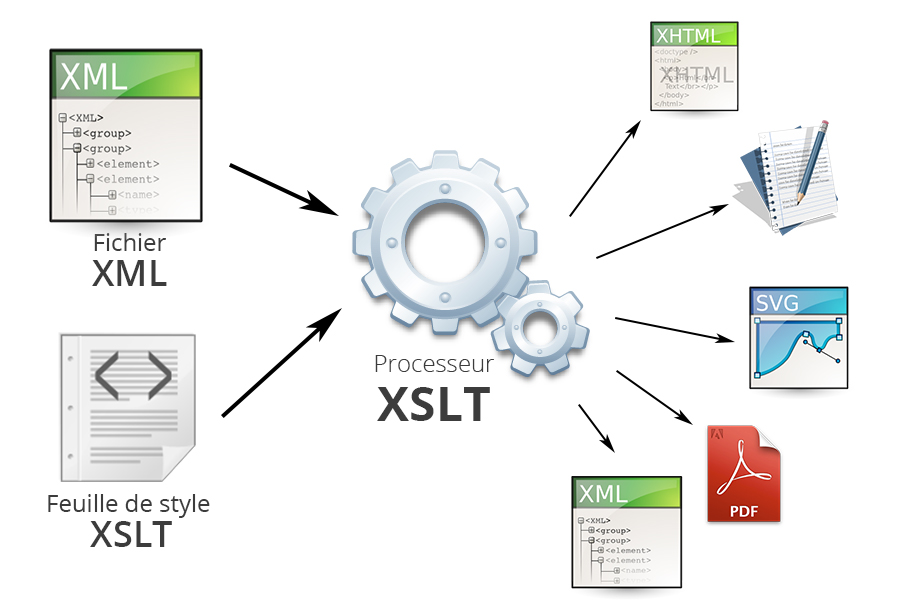

% Technologies XML
% Stéphane Bouvry
% Caen, 2014

# XSLT {data-background="./../images/bg-dtd.jpg"}
Extensible Stylesheet Language Transformations


---

# Présentation

---

## C'est quoi ?

Un langage :

- basé sur XML
- qui utilise XPath pour parcourir une source XML
- et la transformer vers une autre format

---



---

## Transformation

Pour faire une **transformation XSLT** il faut : 

- Un fichier XML source (à transformer)
- Un fichier XSLT (décrit la transformation)
- Un processeur XSLT (assure la transformation)

---

## Le processeur

Le processeur est un programme qui va charger le XML et le XSLT et produire en sortie le résultat : 

- PHP (natif)
- Java (Apache Xalan, Saxon)
- .NET
- C++
- ligne de commande (xsltproc, xalan)

---

### Sortie

XSLT permet nativement de produire les formats suivant : 

- texte
- XML
- HTML/XHTML

---

### Exemple

```xslt
<?xml version="1.0" encoding="utf-8" ?>
<xsl:stylesheet xmlns:xsl="http://www.w3.org/1999/XSL/Transform" 
		version="1.0">
	<xsl:output method="html"/>
	<xsl:template match="/">
		<h2>Hello World</h2>
	</xsl:template>
</xsl:stylesheet>
```
Résultat :
```html
<h2>Hello World</h2>
```

Dans cet exemple, le contenu du XML source n'aura pas d'impact sur le résultat...

---

## Fichier de base

```xslt
<?xml version="1.0" encoding="utf-8" ?>
<xsl:stylesheet xmlns:xsl="http://www.w3.org/1999/XSL/Transform" 
		version="1.0">
	<xsl:output method="html"/>
	<!-- Règles ICI -->
</xsl:stylesheet>
```

Le contenu est dans la racine `<xsl:stylesheet>...</xsl:stylesheet>`

---

## Namespace

On utilise traditionnellement le *namespace* `xsl`

```
xmlns:xsl="http://www.w3.org/1999/XSL/Transform"
```

---

## Format de sortie

Le format de sortie est précisé via l'élément `<xsl:output method="FORMAT" />` :

- html
- text
- xml

---

## Règles

Le fichier contient une (ou plusieurs) règles déclarées avec `<xsl:template></xsl:template>`

```xslt
<xsl:template match="/">
	<h2>Hello World</h2>
</xsl:template>
```

L'attribut `match` permet de spécifier sur quel élément s'applique le template : 

```xslt
<!-- Affiche 'Hello World' pour chaque élément personnage -->
<xsl:template match="//personnage">
	<h2>Hello World</h2>
</xsl:template>
```

--- 

### Transformation par processeur...

En Ligne de commande

```
xsltproc <FICHIER XSLT> <SOURCE XML>
```

ou

```
java -jar libs/xalan.jar
	-IN <SOURCE XML> 
	-XSL <FICHIER XSLT> 
	[-OUT <SORTIE>]
```

D'autre processeur existent, voir leurs documentations respective.

---

### Avec PHP


```php
$xslDoc = new DOMDocument();
$xslDoc->load("stylesheet.xsl");

$xmlDoc = new DOMDocument();
$xmlDoc->load("fichier.xml");

$proc = new XSLTProcessor();
$proc->xslDoc($importStylesheet);

// Transformation
echo $proc->transformToXML($xmlDoc);
```

---

### ...par instuction de traitement

On ajoute une instruction de traitement directement dans le XML : 

```xml
<?xml version="1.0" encoding="utf-8" ?>
<?xml-stylesheet href="style1.xsl" type="text/xsl" ?>
<root>
	<!-- contenu -->
</root>
```

--- 

# XSLT

---

## xsl:output

Attributs :

- format : html, xml, text
- encoding : Encodage
- indent : Applique l'indentation ou pas (yes/no)
- omit-xml-declaration
- doctype-public
- doctype-system

--- 

### Exemple : XHTML

Sortie XHTML : 

```xslt
<xsl:output 
    encoding="utf8" 
    method="xml" 
    doctype-public="-//W3C//DTD XHTML 1.0 Strict//EN" 
    doctype-system="http://www.w3.org/TR/xhtml1/DTD/xhtml1-strict.dtd"
    />
```

Donnera : 

```html
<?xml version="1.0" encoding="UTF-8"?>
<!DOCTYPE html PUBLIC 
	"-//W3C//DTD XHTML 1.0 Strict//EN" 
	"http://www.w3.org/TR/xhtml1/DTD/xhtml1-strict.dtd">
<html>
<head>
	<title>...</title>
</head>
<body>
	TODO
</body>
</html>
```

---

### Exemple : HTML5

```xslt
<xsl:output method="xml" omit-xml-declaration="yes"/>
<xsl:template match="/">
	<xsl:text disable-output-escaping='yes'>&lt;!DOCTYPE html&gt;</xsl:text>
	<html>
		<head>
			<meta charset="utf-8" />
			<title>...</title>
		</head>
		<body>
			TODO
		</body>
	</html>
</xsl:template>
```

Donnera : 

```html
<!DOCTYPE html>
<html>
<head>
	<meta charset="utf-8"/>
	<title>Personnages de game of thrones</title>
</head>
<body>
	TODO
</body>
</html>
```

## xsl:template

Un fichier XSLT contiendra des règles `template` qui s'appliqueront au noeud courant (le document), l'attribut `match` contiendra un chemin XPath

```xslt
<?xml version="1.0" encoding="utf-8" ?>
<xsl:stylesheet xmlns:xsl="http://www.w3.org/1999/XSL/Transform" 
		version="1.0">
	<xsl:output method="html"/>
	<xsl:template match="/">
		<h1>Personnages</h1>
	</xsl:template>
</xsl:stylesheet>
```

---

## Instructions clefs

On peut ensuite compléter le transformation avec : 

- `xsl:for-each`
- `xsl:apply-templates`

---


### xsl:for-each

C'est une boucle classique

```xslt
<?xml version="1.0" encoding="utf-8" ?>
<xsl:stylesheet xmlns:xsl="http://www.w3.org/1999/XSL/Transform" 
		version="1.0">
	<xsl:output method="html" indent="yes"/>
	<xsl:template match="/">
		<h1>Personnages</h1>
		<xsl:for-each select="personnages/personnage">
			<article>
				<h2>
					<xsl:value-of select="prenom" />
					<xsl:text> </xsl:text> 
					<xsl:value-of select="nom" /> 
				</h2>
			</article>
		</xsl:for-each>
	</xsl:template>
</xsl:stylesheet>
```

---

### xsl:apply-templates

```xslt
<?xml version="1.0" encoding="utf-8" ?>
<xsl:stylesheet xmlns:xsl="http://www.w3.org/1999/XSL/Transform" 
		version="1.0">
	<xsl:output method="html" indent="yes"/>

	<xsl:template match="/">
		<h1>Personnages</h1>
		<xsl:apply-templates select="personnages/personnage" />
	</xsl:template>

	<xsl:template match="personnage">
		<article>
			<h2>
				<xsl:value-of select="prenom" />
				<xsl:text> </xsl:text> 
				<xsl:value-of select="nom" /> 
			</h2>
		</article>
	</xsl:template>
</xsl:stylesheet>
```

Si l'attribut `select` est omis, l'application se fait sur `child::*`

---

```xslt
<?xml version="1.0" encoding="utf-8" ?>
<xsl:stylesheet xmlns:xsl="http://www.w3.org/1999/XSL/Transform" 
		version="1.0">
	<xsl:output method="html" indent="yes"/>
	
	<xsl:template match="/">
		<h1>Personnages</h1>
		<xsl:apply-templates />
	</xsl:template>

	<xsl:template match="personnages">
		<xsl:apply-templates />
	</xsl:template>

	<xsl:template match="personnage">
		<article>
			<h2>
				<xsl:value-of select="prenom" />
				<xsl:text> </xsl:text> 
				<xsl:value-of select="nom" /> 
			</h2>
		</article>
	</xsl:template>
</xsl:stylesheet>
```

---

On peut utiliser `xsl:for-each` et `apply-templates` : 
```xslt
<?xml version="1.0" encoding="utf-8" ?>
<xsl:stylesheet xmlns:xsl="http://www.w3.org/1999/XSL/Transform" 
		version="1.0">
	<xsl:output method="html" indent="yes"/>

	<xsl:template match="/">
		<h1>Personnages</h1>
		<xsl:for-each select="personnages/personnage">
			<xsl:apply-templates select="." />
		</xsl:for-each>
	</xsl:template>

	<xsl:template match="personnage">
		<article>
			<h2>
				<xsl:value-of select="prenom" />
				<xsl:text> </xsl:text> 
				<xsl:value-of select="nom" /> 
			</h2>
		</article>
	</xsl:template>
</xsl:stylesheet>
```

--- 

## xsl:value-of

Cette instruction permet de produire du texte à partir d'un chemin XPath : 

```xslt
<article>
	<h2>
		<span class="titre">
			<xsl:value-of select="@titre" /> 
		</span>
		<xsl:value-of select="prenom" />
		<xsl:text> </xsl:text> 
		<xsl:value-of select="nom" /> 
	</h2>
</article>
```

---

# Autres instructions

--- 

**Dans les boucles**

`xsl:sort` Permet de faire des tries


**Conditions**

`xsl:if` Condition simple

`xsl:choose` Switch/case


**Variables**

`xsl:variable` : Déclaration de variable

`xsl:call-template` : Appel un template nommé

`xsl:param` : Paramètres de templates


